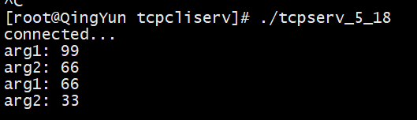

[TOC]

# 概述

本章基于第 04 章介绍的套接字基本函数给出一个TCP简单示例程序并对此做一些运行过程中的步骤解析。此外，还将探讨一些边界情况，比如：客户和服务端启动时会发生什么？客户正常终止会发生什么？服务器在客户端之前终止会发生什么？服务器崩溃会发生什么？

在探讨边界情况时，涉及到很重要的一点是posix信号的处理。


# TCP简单示例

> 以下TCP简单示例参照自《UNIX网络编程（第3版）》第5.2~5.4小节

## 服务端

```cpp
// tcpserv01.c
#include <sys/socket.h>
#include <netinet/in.h>
#include <stdlib.h>
#include <unistd.h>
#include <string.h>
#include <errno.h>
#include <iostream>
using namespace std;

#define SERV_PORT 8888      // 服务端监听端口
#define LISTENQ   1024      // 连接队列最大长度
#define	MAXLINE   4096      // 文本最大长度
#define SA struct sockaddr

void err_quit(const char *fmt, ...) {
    std::cout << fmt << endl;
	_exit(1);
}
// 处理函数
void str_echo(int sockfd) {
    ssize_t n;
    char buf[MAXLINE];

again:
    while ((n = read(sockfd, buf, MAXLINE)) > 0){  // 等待从套接字读入，即等待客户端数据
        write(sockfd, buf, n);                     // 回写数据
        memset(buf, 0, sizeof(buf));
    }

    if (n < 0 && errno == EINTR)                   // EINTR表示由于信号中断，没写成功任何数据
        goto again;
    else if (n < 0)
        err_quit("str_echo: read error");
    else
        cout <<"n: " << n << ", errno: " << errno << endl;
}

int main(int argc, char **argv) { 
    int listenfd, connfd;
    pid_t childpid;
    socklen_t clilen;
    struct sockaddr_in cliaddr, servaddr;        // 服务器地址
    listenfd = socket(AF_INET, SOCK_STREAM, 0);  // 服务端监听套接字

    memset(&servaddr, 0, sizeof(servaddr));      // 初始化服务端地址结构
    servaddr.sin_family = AF_INET;               // 设置协议簇
    servaddr.sin_addr.s_addr = htonl(INADDR_ANY);// 设置地址
    servaddr.sin_port = htons(SERV_PORT);        // 设置端口
    
    bind(listenfd, (SA *)&servaddr, sizeof(servaddr)); // 绑定服务地址、端口
    listen(listenfd, LISTENQ);                         // 

    for (;;) {
        clilen = sizeof(cliaddr);
        connfd = accept(listenfd, (SA *)&cliaddr, &clilen); // 等待客户端连接（阻塞）

        if ((childpid = fork()) == 0) {     // 创建一个进程的副本（子进程），childpid==0，表明是子进程
            cout << "connected..." << endl; 
            close(listenfd);                // 关闭子进程中的监听套接字
            str_echo(connfd);               // 处理函数
            _exit(0);                       // 退出子进程
        }
        close(connfd);  // childpid != 0，表明是父进程，关闭父进程中连接的套接字
    }
}
```

> 从调用 `fork()`  后，进程会产生自身副本的子进程。其中，listenfd套接字和connfd套接字在父进程、子进程都存在一份，此时，子进程中需要关闭自身不需要的listenfd套接字，父进程中需要关闭自身不需要的connfd套接字。否则会导致即使子进程退出，父进程持有connfd套接字句柄，套接字无法释放。

## 客户端

```cpp
// tcpcli01.c
#include <sys/socket.h>
#include <netinet/in.h>
#include <arpa/inet.h>
#include <unistd.h>
#include <string.h>
#include <stdio.h>
#include <iostream>

#define SA          struct sockaddr
#define SERV_PORT   8888   // 服务端口
#define MAXLINE     4096   /* max text line length */
using namespace std;

void err_quit(const char *fmt, ...) {
    std::cout << fmt << endl;
    _exit(1);
}
// 客户端处理函数
void str_cli(FILE *fp, int sockfd) {
    char    sendline[MAXLINE], recvline[MAXLINE];
    while (fgets(sendline, MAXLINE, fp) != NULL) {   // 等待控制台输入
        write(sockfd, sendline, strlen(sendline));   // 写到套接字，即发送到服务端
        if (read(sockfd, recvline, MAXLINE) == 0)    // 从套接字读，即接收服务端数据
            err_quit("str_cli: server terminated prematurely");

        fputs(recvline, stdout);                      // 输出服务端数据
        memset(recvline, 0, sizeof(recvline));
    }
}

int main(int argc, char** argv){
    int sockfd;
    struct sockaddr_in servaddr;

    if(argc != 2){
        err_quit("usage: tcpcli <IP ADDRESS>");
    }
    sockfd = socket(AF_INET, SOCK_STREAM, 0);       // 创建客户端套接字
    
    memset(&servaddr, 0, sizeof(servaddr));         // 
    servaddr.sin_family = AF_INET;                  // 设置地址协议簇
    servaddr.sin_port = htons(SERV_PORT);           // 设置端口
    inet_pton(AF_INET, argv[1], &servaddr.sin_addr);// 设置地址
    
    connect(sockfd, (SA*)&servaddr, sizeof(servaddr)); // 连接服务端
    str_cli(stdin, sockfd);                            // 客户端处理函数
    _exit(0);
}
```

## 运行结果

```shell
[root@QingYun tcpcliserv]# g++ tcpserv01.c -o tcpserv01
[root@QingYun tcpcliserv]# g++ tcpcli01.c -o tcpcli01

# 窗口1:启动服务端
[root@QingYun tcpcliserv]# ./tcpserv01

# 窗口2:启动客户端
[root@QingYun tcpcliserv]# ./tcpcli01 127.0.0.1
# 输入任意内容回车
```


# 僵死问题

> 本小节参考《UNIX网络编程（第3版）》第5.6、5.7节，主要介绍正常终止的过程和僵死问题

## 正常启动

```shell
# 编译
[root@QingYun tcpcliserv]# g++ tcpserv01.c -o tcpserv01
[root@QingYun tcpcliserv]# g++ tcpcli01.c -o tcpcli01

# 窗口1：运行服务端
[root@QingYun tcpcliserv]# ./tcpserv01

# 窗口2：运行客户端
[root@QingYun tcpcliserv]# ./tcpcli01 127.0.0.1
# 输入任意内容
```

查看端口(`netstat -anlt | grep 8888`)


查看程序状态(`ps a -o pid,ppid,tty,stat,args,wchan | grep -v grep | egrep "tcp|PPID"`)


> 正常启动指的是启动过程中没有遇到类似网络不可达、程序意外终止的异常情况

## 正常终止

当从控制台输入 `Ctrl+C` 或者 `Ctrl+D` (键入EOF字符)以终止客户端，此时执行`netstat` 可以看到

查看端口(`netstat -anlt | grep 8888`)


查看程序状态(`ps a -o pid,ppid,tty,stat,args,wchan | grep -v grep | egrep "tcp|PPID"`)


> 键入EOF字符后，客户端和服务端会经历以下步骤：
>
> 1. 键入EOF字符后，`fgets`返回一个空指针，客户端会终止`fget`所在行的循环
> 2. main函数中通过_exit(0)退出客户端程序
> 3. 进程终止时内核会关闭所有打开的描述符。因此，客户端TCP发送一个FIN给服务器，服务器则以ACK响应，至此，服务器socket处于CLOSE_WAIT状态，客户端socket处于FIN_WAIT_2状态
> 4. 服务端TCP接收FIN时，`read()`返回0，这将导致子进程终止循环并退出 `str_echo()` 返回 `main()`，并且通过`exit()`终止进程
> 5. 服务端子进程终止时同样由内核关闭所有打开的描述符：服务端发送FIN到客户端，客户端响应ACK到服务端，至此连接终止，服务端子进程socket关闭连接，客户端socket进入TIME_WAIT状态

然而，`这里有个问题！` —— 在查看程序状态的时候，子进程（PID 8589）在正常终止之后并没有退出，而是进入`僵死状态`（STAT: Z+）！

这是因为：服务端的子进程虽然调用了`exit()`终止时，但并不能直接释放，而是发送给父进程一个`SIGCHLD`信号，随后子进程进入`僵死状态`，等待父进程处理该信号并释放子进程资源（如果父进程没有处理该信号，则会导致子进程一直处于`僵死状态`）。

换言之，子进程终止了但并没有释放，除非父进程处理子进程，否则会一直处于`僵死状态`并占用系统资源。

# posix信号

> 本小节参考《UNIX网络编程（第3版）》第5.8、5.9节，主要介绍使用 `posix信号` 处理僵死问题

信号（`signal`）是告知某个进程发生了某个事件的通知，有时也称软件中断（`software interrupt`）

信号可以：由一个进程发给另一个进程（或自身）；或者由内核发给某个进程。

每个信号都有一个与之关联的处置，也成为行为（`action`）。设定信号处置的方法由三种：

1. 捕获信号：提供一个函数，只要有特定信号发生，关联的行为就会被调用，这样的函数也称之为`信号处理函数`。
2. 忽略信号：把某个信号的处置设定为`SIG_IGN`来忽略该信号（`SIGKILL`和`SIGSTOP`不能被忽略）
3. 默认处置：可以把某个信号的处置设置为`SIG_DFL`来启用默认处置。

## 信号语义

- 信号处理函数一旦安装，便一直存在可以多次触发
- 信号函数处理期间，正被递交的信号是阻塞的。安装处理函数时传递给sigaction函数的sa_mask信号集中的额外信号也被阻塞。
- 一个信号被阻塞期间产生了多次，改信号在解阻塞之后通常只提交一次（即默认不排队）
- 利用sigprocmask函数选择性地阻塞或解阻塞一组信号是可能的。

## 处理SIGCHLD信号（解决僵死问题）

将上述 `tcpser01.c` 服务端代码修改为`tcpserv04.c`，客户端代码`tcpcli01.c`不变，修改后的服务端代码如下：

```cpp
// tcpserv04.c
#include <sys/socket.h>
#include <netinet/in.h>
#include <stdlib.h>
#include <unistd.h>
#include <string.h>
#include <errno.h>
#include <iostream>
#include <signal.h>
#include <wait.h>
using namespace std;

#define SERV_PORT 8888
#define LISTENQ 1024
#define	MAXLINE		4096	/* max text line length */
#define SA struct sockaddr

void err_quit(const char *fmt, ...) {
    std::cout << fmt << endl;
	_exit(1);
}

void str_echo(int sockfd) {
    ssize_t n;
    char buf[MAXLINE];

again:
    while ((n = read(sockfd, buf, MAXLINE)) > 0){
        write(sockfd, buf, n);
        memset(buf, 0, sizeof(buf));
    }

    if (n < 0 && errno == EINTR)
        goto again;
    else if (n < 0)
        err_quit("str_echo: read error");
    else
        cout <<"n: " << n << ", errno: " << errno << endl;
}

// 定义信号关联的行为函数
void sig_chld(int signo){
    pid_t pid;
    int   stat;
    pid = wait(&stat);
    printf("child %d terminated\n", pid);
    return;
}

int main(int argc, char **argv) { 
    int listenfd, connfd;
    pid_t childpid;
    socklen_t clilen;
    struct sockaddr_in cliaddr, servaddr;
    listenfd = socket(AF_INET, SOCK_STREAM, 0);

    memset(&servaddr, 0, sizeof(servaddr));
    servaddr.sin_family = AF_INET;
    servaddr.sin_addr.s_addr = htonl(INADDR_ANY);
    servaddr.sin_port = htons(SERV_PORT);
    bind(listenfd, (SA *)&servaddr, sizeof(servaddr));
    listen(listenfd, LISTENQ);
    signal(SIGCHLD, sig_chld);  // 安装信号

    for (;;) {
        clilen = sizeof(cliaddr);
        connfd = accept(listenfd, (SA *)&cliaddr, &clilen);

        if ((childpid = fork()) == 0) {
            cout << "connected..." << endl;
            close(listenfd);
            str_echo(connfd);
            _exit(0);
        }
        close(connfd);
    }
}
```

> 其中：`sig_chld()` 是定义信号关联的行为函数，并在`listen()` 后的`signal()` 安装信号的处理函

运行上述程序：

```shell
# 窗口1：启动服务端
[root@QingYun tcpcliserv]# ./tcpserv04

# 窗口2：启动客户端
[root@QingYun tcpcliserv]# ./tcpcli01 127.0.0.1
# 输入任意内容
```

查看端口(`netstat -anlt | grep 8888`)


查看程序状态(`ps a -o pid,ppid,tty,stat,args,wchan | grep -v grep | egrep "tcp|PPID"`)


正常终止程序后，在窗口1可以看到`sig_chld()`函数调用输出


再次查看端口(`netstat -anlt | grep 8888`)


查看程序状态(`ps a -o pid,ppid,tty,stat,args,wchan | grep -v grep | egrep "tcp|PPID"`)


> 可见，在安装处理函数之后，正常终止的程序不再产生`僵死的子进程`。
>
> 然而，如果你认为这就结束了，那你可能还是高兴早了(￣▽￣)"


# 新的僵死问题

> 上一小节的 `处理SIGCHLD信号` 中介绍了使用`signal()` 安装处理子进程的 `SIGCHLD` 信号的处理函数来解决子进程僵死问题。然而，如果你还记得`信号语义` 中的第三点（`信号默认不排队`），你或许能想到接下来要讲到的问题。
>
> 本小节参考《UNIX网络编程（第3版）》第5.10节，介绍新的僵死问题 —— 多个客户端导致的僵死问题

## 问题复现

将客户端代码`tcpcli01.c` 改成同时发起多个socket连接来模拟多个客户端，修改后代码 `tcpcli04.c` 如下：

```cpp
// tcpcli04.c
#include <sys/socket.h>
#include <netinet/in.h>
#include <arpa/inet.h>
#include <unistd.h>
#include <string.h>
#include <stdio.h>
#include <iostream>

#define SA          struct sockaddr
#define SERV_PORT   8888
#define MAXLINE     4096   /* max text line length */
using namespace std;

void err_quit(const char *fmt, ...) {
    std::cout << fmt << endl;
    _exit(1);
}

void str_cli(FILE *fp, int sockfd) {
    char    sendline[MAXLINE], recvline[MAXLINE];
    while (fgets(sendline, MAXLINE, fp) != NULL) {
        write(sockfd, sendline, strlen(sendline));
        if (read(sockfd, recvline, MAXLINE) == 0)
            err_quit("str_cli: server terminated prematurely");

        fputs(recvline, stdout);
        memset(recvline, 0, sizeof(recvline));
    }
}

int main(int argc, char** argv){
    int sockfd[5];
    struct sockaddr_in servaddr;

    if(argc != 2){
        err_quit("usage: tcpcli <IP ADDRESS>");
    }
    for(int i=0;i<5;i++){
        sockfd[i] = socket(AF_INET, SOCK_STREAM, 0);
        memset(&servaddr, 0, sizeof(servaddr));
        servaddr.sin_family = AF_INET;
        servaddr.sin_port = htons(SERV_PORT);
        inet_pton(AF_INET, argv[1], &servaddr.sin_addr);
        connect(sockfd[i], (SA*)&servaddr, sizeof(servaddr));
    }
    str_cli(stdin, sockfd[0]);
    _exit(0);
}
```

运行程序

```shell
# 编译
[root@QingYun tcpcliserv]# g++ tcpserv04.c -o tcpserv04
[root@QingYun tcpcliserv]# g++ tcpcli04.c -o tcpcli04

# 窗口1：运行服务端
[root@QingYun tcpcliserv]# ./tcpserv04

# 窗口2：运行客户端
[root@QingYun tcpcliserv]# ./tcpcli04 127.0.0.1
# 输入任意内容
```

查看端口(`netstat -anlt | grep 8888`)


查看程序状态(`ps a -o pid,ppid,tty,stat,args,wchan | grep -v grep | egrep "tcp|PPID"`)


终止客户端程序，服务端打印内容：


查看端口(`netstat -anlt | grep 8888`)


查看程序状态(`ps a -o pid,ppid,tty,stat,args,wchan | grep -v grep | egrep "tcp|PPID"`)


> 可以看到，客户端和服务端建立的5个连接后，服务端 `fork` 出来5个子进程，然而，即使加上了上一节中对`SIGCHLD` 信号的处理，依然留下来4个僵死的子进程。

## 问题分析

客户端建立多个连接后，父进程每接收到一个建连请求都将 `fork` 一个子进程，如图5-8所示。


当客户端终止时，所有打开的描述符由内核自动关闭，且所有5个连接基本同一时刻终止，并向服务端发送5个FIN。服务端5个子进程基本在同一时刻终止进程并向父进程发送 `SIGCHLD` 信号，如图5-10所示：


结合我们之前`信号语义` 中所说：信号默认不排队 —— 即5个`SIGCHLD` 信号只被触发并处理一次，因此遗留4个僵死进程。


# wait和waitpid（解决新的僵死问题）

> 本小节参考《UNIX网络编程（第3版）》第5.10节，介绍 `wait()`和 `waitpid()` 函数

```cpp
#include<sys/wait.h>
pid_t wait(int *__stat_loc);                                // 成功返回pid，失败返回0或-1
pid_t waitpid(pid_t __pid, int *__stat_loc, int __options); // 成功返回pid，失败返回0或-1
```

`wait` 和 `waitpid` 均返回进程号`PID`和`__stat_loc`，其中PID表示已终止的进程号，__stat_loc指针是一个返回值，表示进程终止的状态（整数）

此外，`waitpid` 多出`__pid`和`__options`两个参数，参数 `__pid` 为欲等待的子进程识别码（-1表示等待所有子进程），参数 `__options` 可指定附加选项，常用为WNOHANG：如果没有终止子进程则马上返回, 不阻塞等待。

#### wait() 和waitpid() 的区别

`wait()`等待第一个终止的子进程。`waitpid()`可以通过`pid`参数指定等待哪一个子进程。当pid=-1、option=0时，waitpid函数等同于wait，可以把wait看作waitpid实现的特例。

waitpid函数提供了wait函数没有提供的三个功能：
 1、waitpid等待一个特定的进程，而wait则返回任一终止子进程的状态 。
 2、waitpid提供了一个 wait的非阻塞版本，有时希望取得一个子进程的状态，  但不想进程阻塞。
 3、waitpid支持作业控制。

> 更多wait和waitpid的内容可以参考连接：https://www.jianshu.com/p/e0c6749dbcdc

## 使用waitpid解决僵死问题

将`tcpser04.c` 中 `wait()`  替换成 `waitpid()`  修改为代码`tcpser04_waitpid.c`如下：

```cpp
// tcpser04_waitpid.c
#include <sys/socket.h>
#include <netinet/in.h>
#include <stdlib.h>
#include <unistd.h>
#include <string.h>
#include <errno.h>
#include <iostream>
#include <signal.h>
#include <wait.h>
using namespace std;

#define SERV_PORT 8888
#define LISTENQ 1024
#define	MAXLINE		4096	/* max text line length */
#define SA struct sockaddr

void err_quit(const char *fmt, ...) {
    std::cout << fmt << endl;
	_exit(1);
}

void str_echo(int sockfd) {
    ssize_t n;
    char buf[MAXLINE];

again:
    while ((n = read(sockfd, buf, MAXLINE)) > 0){
        write(sockfd, buf, n);
        memset(buf, 0, sizeof(buf));
    }

    if (n < 0 && errno == EINTR)
        goto again;
    else if (n < 0)
        err_quit("str_echo: read error");
    else
        cout <<"n: " << n << ", errno: " << errno << endl;
}

void sig_chld(int signo){
    pid_t pid;
    int   stat;
    while((pid=waitpid(-1, &stat, WNOHANG)) > 0)
        printf("child %d terminated\n", pid);
    return;
}

int main(int argc, char **argv) { 
    int listenfd, connfd;
    pid_t childpid;
    socklen_t clilen;
    struct sockaddr_in cliaddr, servaddr;
    listenfd = socket(AF_INET, SOCK_STREAM, 0);

    memset(&servaddr, 0, sizeof(servaddr));
    servaddr.sin_family = AF_INET;
    servaddr.sin_addr.s_addr = htonl(INADDR_ANY);
    servaddr.sin_port = htons(SERV_PORT);
    bind(listenfd, (SA *)&servaddr, sizeof(servaddr));
    listen(listenfd, LISTENQ);
    signal(SIGCHLD, sig_chld);

    for (;;) {
        clilen = sizeof(cliaddr);
        connfd = accept(listenfd, (SA *)&cliaddr, &clilen);

        if ((childpid = fork()) == 0) {
            cout << "connected..." << endl;
            close(listenfd);
            str_echo(connfd);
            _exit(0);
        }
        close(connfd);
    }
}
```

> 真正的解决方法是调用`waitpid` 而不是 `wait`，原因在于：在一个循环内调用`waitpid`获取所有已终止的子进程，必须指定`WNOHANG`选项，他告知`waitpid`在有尚未终止的子进程在运行时不要阻塞。而`wait`在有尚未终止的子进程在运行时一定会阻塞。

运行结果：


查看端口(`netstat -anlt | grep 8888`)


查看程序状态(`ps a -o pid,ppid,tty,stat,args,wchan | grep -v grep | egrep "tcp|PPID"`)


# 边界问题

> 本小节参考自《UNIX网络编程（第3版）》第5.11~5.16节，主要探讨一些特殊情况下的边界的特殊情况。

## 客户端写入`RST`的连接

> 本小节参考《UNIX网络编程（第3版）》第5.13节

考虑这样一种情况，如果客户端在每次`readline()`之后不处理可能出现的错误，反而不断向错误的连接中写入数据会如何？例如，当客户端向服务器发送两次数据，第一次发送数据后收到`RST`错误，第二次会发生什么？

实际上，当进程向一个`RST`的socket写入时，内核会向该进程发送`SIGPIPE`信号，并且写操作返回`EPIPE`错误。

**这节看的不是很懂，另外因为RST的错误不知道怎么模拟出来，书上的一个示例没实现**


## 服务端进程终止

>  注意：这里说的 `服务端进程` 指的是 `服务端子进程`，此外， `进程终止` 和 `进程崩溃` 不一样！！！
>
> `进程终止`由内核负责关闭打开的连接符，即服务端会发出FIN告知客户端断开socket连接。
>
> `进程崩溃`在瞬间发生，并且不会关闭打开的连接，这种情况和网络不可达是一样的现象。

步骤

```shell
# 步骤1：在窗口1 使用tcpdump命令抓包
[root@QingYun tcpcliserv]# tcpdump -i any src port 8888 or dst port 8888 -n -nn

# 步骤2：在窗口2 打开服务端进程
[root@QingYun tcpcliserv]# ./tcpserv04

# 步骤3：在窗口3 打开客户端进程（这里用tcpcli01程序更易于观察）
[root@QingYun tcpcliserv]# ./tcpcli01 127.0.0.1

# 步骤4：在客户端键入任意内容后，使用以下命令分别查看TCP状态和进程状态
[root@QingYun tcpcliserv]# netstat -anlt | grep 8888
[root@QingYun ~]# ps a -o pid,ppid,tty,stat,args,wchan | grep -v grep | egrep "tcp|PPID"

# 步骤5：找到子进程号，并执行kill命令杀死服务端子进程
[root@QingYun ~]# kill -s 9 25048

# 步骤6：再次键入任意内容，观察客户端和服务端的结果
```

过程分析

- 完成步骤1~2后，客户端和服务端建立好TCP连接（交互1）
- 完成步骤1~4后，通过客户端回显正常可以验证一切正常（交互2）
- 执行步骤5后，子进程被迫终止并由系统内核释放所有打开的描述符。这就导致服务端程序会想客户端程序发送FIN，客户端响应ACK（交互3，此时服务端为FIN_WAIT2，客户端为CLOSE_WAIT）。
- 服务端子进程终止后，`SIGCHLD`信号将发送到服务端父进程，服务端控制台打印`child xxx terminated`
- 此时，客户端阻塞在`fget()`，步骤6键入任意内容后，客户端将键入的信息通过TCP发给服务端（服务端发送了FIN表示服务端不会发送数据(`半连接`)，所以客户端发送数据时允许的）。而服务端子进程实际上已经终止了，所以服务端会直接响应RST，表示服务端已经重置该链接（交互4）。
- 由于客户端在调用玩`write()`之后立即调用了`readline()`， 并且由于服务端在前已经发过FIN，因此`readline()`直接返回0(表示EOF)。于是客户端以错误信息 `server terminater prematurely`退出。

服务端控制台输出


客户端控制台输出


查看TCP连接端口、程序状态


抓包详情


> - 交互1：服务端和客户端完成三次握手
> - 交互2：四个数据包分别为客户端发送数据、服务端响应ACK、服务端回复数据、客户端响应ACK
> - 交互3：服务端子进程终止时，内核关闭描述符时发送FIN
> - 交互4：已经重置该连接

## 服务端主机崩溃

> 注意：服务端主机崩溃和服务器关机不一样！
>
> `服务端关机`和`进程终止`一样，由内核负责关闭打开的连接符，服务端会发出FIN告知客户端断开socket连接。
>
> `主机崩溃`和`进程崩溃`一样，不会关闭打开的连接，这种情况和网络不可达是一样的现象。

模拟服务器子进程崩溃必须在不同的服务器上面分别运行服务端程序、客户端程序。

模拟过程：首先打开服务端程序，然后打开客户端，键入一行文本确认工作正常后断开服务端和客户端的网络连接，再次从客户端键入一行文本。

服务端和客户端工作过程分析：

1. 服务端崩溃之后不能发出任何东西
2. 客户端键入一行信息后，程序中的`str_cli()` 函数中的 `write()`将信息写入套接字，交由内核使用TCP发送，客户端程序阻塞在`readline()`
3. 然而由于服务端无法响应ACK，客户端持续重传该信息，知道超时放弃重传，并且返回`网络不可达`的ICMP错误信息。

## 服务端主机崩溃后重启

模拟服务器子进程崩溃必须在不同的服务器上面分别运行服务端程序、客户端程序。

模拟过程：首先打开服务端程序，然后打开客户端，键入一行文本确认工作正常后断开服务端和客户端的网络连接，在断开网络之后重启服务器和服务端程序，待服务端重启成功之后，再次从客户端键入一行文本。

> 断开网络为了在重启服务器过程中，不然服务端的FIN发送到客户端。
>
> 重启服务端是为了模拟程序因为崩溃而导致TCP信息丢失。

服务端和客户端工作过程分析：

1. 服务端崩溃之后不能发出任何东西，因此客户端不知道服务端崩溃（假设客户端没有使用SO_KEEPLIVE）
2. 服务端重启后，客户端键入信息并发送到服务端。
3. 由于服务端崩溃后重启已经丢失了所有连接信息，因此服务端响应RST。
4. 客户端接收RST时，客户端程序正阻塞在`readline()`，导致调用返回`ECONNRESET`错误。


## 服务端主机关机

UNIX系统关机时，init进程通常先给所有进程发送`SIGTERM`信号（该信号可以被捕获），等待一段时间（通常5~20秒之间），然后给所有仍在运行的程序发送`SINGKILL`信号强制终止所有进程。而在进程终止时，内核负责关闭所有打开的描述符，随后发生的步骤和 `服务端进程终止` 的边界情况一致。


# 数据格式

> 本小节参考自《UNIX网络编程（第3版）》第5.18节，讨论关于传输数据格式的一些基础问题。

在之前的例子中我们都是发送文本数据，文本数据在读写时只管读到文本结尾，而不涉及到数据的解析。而在实际的项目开发中，涉及到的数据不仅由整数、浮点数还可能有自定义结构的数据。本节将简单介绍传递二进制数据的示例。

## 示例

### 服务端

```cpp
// tcpserv_5_18.c
#include <sys/socket.h>
#include <netinet/in.h>
#include <stdlib.h>
#include <unistd.h>
#include <string.h>
#include <errno.h>
#include <iostream>
#include <signal.h>
#include <wait.h>
using namespace std;

#define SERV_PORT 8888
#define LISTENQ 1024
#define	MAXLINE		4096	/* max text line length */
#define SA struct sockaddr
typedef struct args
{
    long arg1;
    long arg2;
}args;

typedef struct result
{
    long sum;
    long product;
    long difference;
    double quotient;
}result;

void err_quit(const char *fmt, ...) {
    std::cout << fmt << endl;
	_exit(1);
}

void str_echo(int sockfd) {
    args    d;
    result  res;
    ssize_t n;

again:
    while ((n = read(sockfd, &d, sizeof(args))) > 0){
        printf("arg1: %ld\n", d.arg1);
        printf("arg2: %ld\n", d.arg2);

        res.difference = d.arg1 - d.arg2;
        res.quotient = 1.0 * d.arg1 / d.arg2;
        res.product = d.arg1 * d.arg2;
        res.sum = d.arg1 + d.arg2;

        write(sockfd, &res, sizeof(result));
        memset(&res, 0, sizeof(result));
        memset(&d, 0, sizeof(args));
    }

    if (n < 0 && errno == EINTR)
        goto again;
    else if (n < 0)
        err_quit("str_echo: read error");
    else
        cout <<"n: " << n << ", errno: " << errno << endl;
}

void sig_chld(int signo){
    pid_t pid;
    int   stat;
    while((pid=waitpid(-1, &stat, WNOHANG)) > 0)
        printf("child %d terminated\n", pid);
    return;
}

int main(int argc, char **argv) { 
    int listenfd, connfd;
    pid_t childpid;
    socklen_t clilen;
    struct sockaddr_in cliaddr, servaddr;
    listenfd = socket(AF_INET, SOCK_STREAM, 0);

    memset(&servaddr, 0, sizeof(servaddr));
    servaddr.sin_family = AF_INET;
    servaddr.sin_addr.s_addr = htonl(INADDR_ANY);
    servaddr.sin_port = htons(SERV_PORT);
    bind(listenfd, (SA *)&servaddr, sizeof(servaddr));
    listen(listenfd, LISTENQ);
    signal(SIGCHLD, sig_chld);

    for (;;) {
        clilen = sizeof(cliaddr);
        connfd = accept(listenfd, (SA *)&cliaddr, &clilen);

        if ((childpid = fork()) == 0) {
            cout << "connected..." << endl;
            close(listenfd);
            str_echo(connfd);
            _exit(0);
        }
        close(connfd);
    }
}
```

### 客户端

```cpp
// tcpcli_5_18.c
#include <sys/socket.h>
#include <netinet/in.h>
#include <arpa/inet.h>
#include <unistd.h>
#include <string.h>
#include <stdio.h>
#include <iostream>

#define SA          struct sockaddr
#define SERV_PORT   8888
#define MAXLINE     4096   /* max text line length */
using namespace std;

typedef struct args
{
    long arg1;
    long arg2;
}args;

typedef struct result
{
    long sum;
    long product;
    long difference;
    double quotient;
}result;


void err_quit(const char *fmt, ...) {
    std::cout << fmt << endl;
    _exit(1);
}

void str_cli(FILE *fp, int sockfd) {
    args    d;
    result  res;
    char    sendline[MAXLINE];

    while (fgets(sendline, MAXLINE, fp) != NULL) {
        if(sscanf(sendline, "%ld%ld", &d.arg1, &d.arg2)!=2){
            printf("invalid input: %s", sendline);
            continue;
        }

        write(sockfd, &d, sizeof(args));
        if (read(sockfd, &res, sizeof(result)) == 0)
            err_quit("str_cli: server terminated prematurely");

        printf("sum: %ld\n", res.sum);
        printf("product: %ld\n", res.product);
        printf("quotient: %lf\n", res.quotient);
        printf("difference: %ld\n", res.difference);
        memset(&res, 0, sizeof(result));
    }
}

int main(int argc, char** argv){
    int sockfd;
    struct sockaddr_in servaddr;

    if(argc != 2){
        err_quit("usage: tcpcli <IP ADDRESS>");
    }
    sockfd = socket(AF_INET, SOCK_STREAM, 0);
    memset(&servaddr, 0, sizeof(servaddr));
    servaddr.sin_family = AF_INET;
    servaddr.sin_port = htons(SERV_PORT);
    inet_pton(AF_INET, argv[1], &servaddr.sin_addr);
    connect(sockfd, (SA*)&servaddr, sizeof(servaddr));
    str_cli(stdin, sockfd);
    _exit(0);
}
```

### 运行结果

客户端


服务端



## 潜在问题

实际上，示例中还存在三个潜在问题：

1. 不同实现可能以不同的格式存储数据（比如大小端数据）
2. 不同实现在存储同一数据类型上可能存在差异（比如32位和64位系统中，short，int，long可能不一致）
3. 不同实现给数据结构的打包方式可能存在差异

解决这些问题的两种常用方法：

1. 把所有数据值转为字符串传输（客户端和服务端必须具有相同字符集）
2. 显示定义数据类型的二进制格式（位数、大小端），并以这样的格式传递所有数据。（远程调用过程RPC通常使用这种方式）
