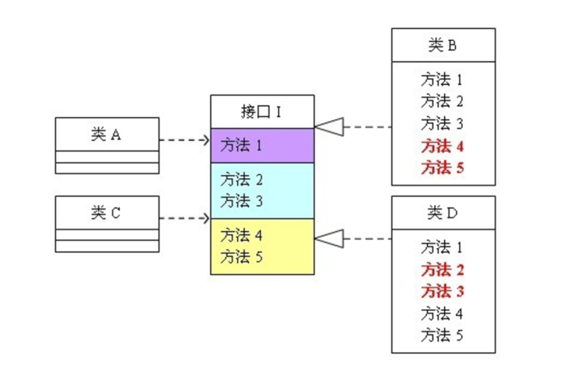
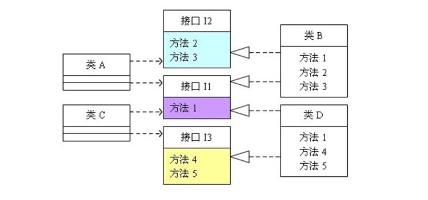
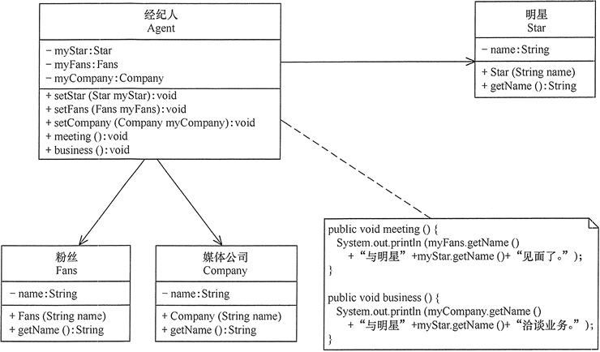
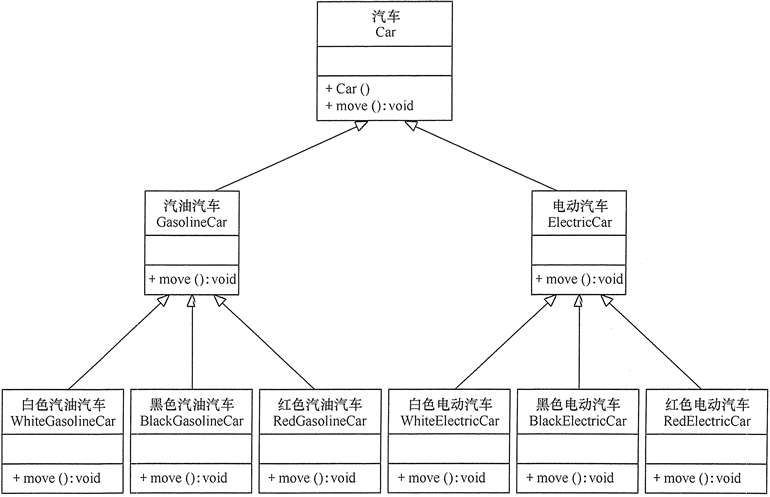

[TOC]

# 七大设计原则

## 开闭原则(Open Closed Principle，OCP)

### 定义

软件实体(模块、类与接口、方法等)应当对扩展开放，对修改关闭（Software entities should be open for extension，but closed for modification）

### 优点

- 提高代码的适应性：能够扩展已存在的系统，能够提供新的功能满足新的需
- 提高软件的可维护性：已存在的抽象模块，不需要被修改，软件有很强的稳定性

### 示例

举个简单例子，这里有个生产电脑的公司，根据输入的类型，生产出不同的电脑，代码如下:

```java
interface Computer {}
class Macbook implements Computer {}
class Surface implements Computer {}
class Factory {
    public Computer produceComputer(String type) {
        Computer c = null;
        if(type.equals("macbook")){
            c = new Macbook();
        }else if(type.equals("surface")){
            c = new Surface();
        }
        return c;
    }   
}
```

显然上面的代码违背了开放 - 关闭原则，如果需要添加新的电脑产品，那么修改 produceComputer 原本已有的方法，正确的方式如下：

```java
interface Computer {}
class Macbook implements Computer {}
class Surface implements Computer {}
interface Factory {
    public Computer produceComputer();
}
class AppleFactory implements Factory {
    public Computer produceComputer() {
        return new Macbook();
    }
}
class MSFactory implements Factory {
    public Computer produceComputer() {
        return new Surface();
    }
}
```

正确的方式应该是将 Factory 抽象成接口，让具体的工厂(如苹果工厂，微软工厂)去实现它，生产它们公司相应的产品，这样写有利于扩展，如果这是需要新增加戴尔工厂生产戴尔电脑，我们仅仅需要创建新的电脑类和新的工厂类，而不需要去修改已经写好的代码。

## 单一职责原则 (Single Responsibility Principle，SRP)

### 定义

一个类应该有且仅有一个引起它变化的原因，否则类应该被拆分（There should never be more than one reason for a class to change）。

### 优点

- 降低类的复杂度：一个类只负责一项职责，其逻辑肯定要比负责多项职责简单得多。
- 提高系统的可维护性：复杂度越低，可读性越高，更容易维护。
- 降低变更引起的风险：当修改一个功能时，可以显著降低对其他功能的影响。

### 示例

有一个动物类，它会呼吸空气，用一个类描述动物呼吸这个场景：

```java
class Animal{  
    public void breathe(String animal){  
        System.out.println(animal + "呼吸空气");  
    }  
}  
public class Client{  
    public static void main(String[] args){  
        Animal animal = new Animal();  
        animal.breathe("牛");  
        animal.breathe("羊");  
        animal.breathe("猪");  
    }  
}  
```

在后来发现新问题，并不是所有的动物都需要呼吸空气，比如鱼需要呼吸水，修改时如果遵循单一职责原则的话，那么需要将 Animal 类进行拆分为陆生类和水生动物类，代码如下:

```java
class Terrestrial{  
    public void breathe(String animal){  
        System.out.println(animal + "呼吸空气");  
    }  
}  
class Aquatic{  
    public void breathe(String animal){  
        System.out.println(animal + "呼吸水");  
    }  
}  
  
public class Client{  
    public static void main(String[] args){  
        Terrestrial terrestrial = new Terrestrial();  
        terrestrial.breathe("牛");  
        terrestrial.breathe("羊");  
        terrestrial.breathe("猪");  
          
        Aquatic aquatic = new Aquatic();  
        aquatic.breathe("鱼");  
    }  
}  
```

在实际工作中，如果这样修改的话开销是很大的，除了将原来的 Animal 类分解为 Terrestrial 类和 Aquatic 类以外还需要修改客户端，而直接修改类 Animal 类来达到目的虽然违背了单一职责原则，但是花销却小的多，代码如下:

```java
class Animal{  
    public void breathe(String animal){  
        if("鱼".equals(animal)){  
            System.out.println(animal + "呼吸水");  
        }else{  
            System.out.println(animal + "呼吸空气");  
        }  
    }  
}  

public class Client{  
    public static void main(String[] args){  
        Animal animal = new Animal();  
        animal.breathe("牛");  
        animal.breathe("羊");  
        animal.breathe("猪");  
        animal.breathe("鱼");  
    }  
}
```

可以看得出，这样的修改显然简便了许多，但是却存在着隐患，如果有一天有需要加入某类动物不需要呼吸，那么就要修改 Animal 类的 breathe 方法，而对原有代码的修改可能会对其他相关功能带来风险，也许有一天你会发现输出结果变成了："牛呼吸水" 了，这种修改方式直接在代码级别上违背了单一职责原则，虽然修改起来最简单，但隐患却最大的。

另外还有一种修改方式:

```java
class Animal{  
    public void breathe(String animal){  
        System.out.println(animal + "呼吸空气");  
    }  
  
    public void breathe2(String animal){  
        System.out.println(animal + "呼吸水");  
    }  
}  
  
public class Client{  
    public static void main(String[] args){  
        Animal animal = new Animal();  
        animal.breathe("牛");  
        animal.breathe("羊");  
        animal.breathe("猪");  
        animal.breathe2("鱼");  
    }  
}  
```

可以看出，这种修改方式没有改动原来的代码，而是在类中新加了一个方法，这样虽然违背了单一职责原则，但是它并没有修改原来已存在的代码，不会对原本已存在的功能造成影响。

那么在实际编程中，需要根据实际情况来确定使用哪种方式，只有逻辑足够简单，才可以在代码级别上违背单一职责原则。

## 依赖倒置原则(Dependence Inversion Principle，DIP)

### 定义

高层模块不应该依赖低层模块，两者都应该依赖其抽象；抽象不应该依赖细节，细节应该依赖抽象（High level modules shouldnot depend upon low level modules.Both should depend upon abstractions.Abstractions should not depend upon details. Details should depend upon abstractions）

其核心思想：要面向接口编程，不要面向实现编程。

### 优点

- **降低类间的耦合性。**
- 提高系统的稳定性。
- 减少并行开发引起的风险。
- 提高代码的可读性和可维护性。

### 示例

母亲给孩子讲故事，只要给她一本书，她就可照着书给孩子讲故事了。代码如下：

```java
class Book{  
    public String getContent(){  
        return "这是一个有趣的故事";  
    }  
}  
  
class Mother{  
    public void say(Book book){  
        System.out.println("妈妈开始讲故事");  
        System.out.println(book.getContent());  
    }  
}  
  
public class Client{  
    public static void main(String[] args){  
        Mother mother = new Mother();  
        mother.say(new Book());  
    }  
}  
```

假如有一天，给的是一份报纸，而不是一本书，让这个母亲讲下报纸上的故事，报纸的代码如下：

```java
class Newspaper{  
    public String getContent(){  
        return "这个一则重要的新闻";  
    }  
}  
```

然而这个母亲却办不到，应该她只会读书，这太不可思议，只是将书换成报纸，居然需要修改 Mother 类才能读，假如以后需要换成了杂志呢？原因是 Mother 和 Book 之间的耦合度太高了，必须降低他们的耦合度才行。

我们可以引入一个抽象接口 IReader 读物，让书和报纸去实现这个接口，那么无论提供什么样的读物，该母亲都能读。代码如下：

```java
interface IReader{  
    public String getContent();  
}  

class Newspaper implements IReader {  
    public String getContent(){  
        return "这个一则重要的新闻";  
    }  
}  
class Book implements IReader{  
    public String getContent(){  
        return "这是一个有趣的故事";  
    }  
}  
  
class Mother{  
    public void say(IReader reader){  
        System.out.println("妈妈开始讲故事");  
        System.out.println(reader.getContent());  
    }  
}  
  
public class Client{  
    public static void main(String[] args){  
        Mother mother = new Mother();  
        mother.say(new Book());  
        mother.say(new Newspaper());  
    }  
}
```

这样修改之后，以后无论提供什么样的读物，只要去实现了 IReader 接口之后就可以被母亲读。实际情况中，代表高层模块的 Mother 类将负责完成主要的业务逻辑，一旦需要对它进行修改，引入错误的风险极大。所以遵循依赖倒转原则可以降低类之间的耦合性，提高系统的稳定性，降低修改程序造成的风险。

## 接口隔离原则(Interface Segregation Principle，ISP)

### 定义

客户端不应该被迫依赖于它不使用的方法（Clients should not be forced to depend on methods they do not use）

该原则还有另外一个定义：一个类对另一个类的依赖应该建立在最小的接口上（The dependency of one class to another one should depend on the smallest possible interface）

#### 和`单一职责原则`的区别

接口隔离原则和单一职责都是为了提高类的内聚性、降低它们之间的耦合性，体现了封装的思想，但两者不同：

- 单一职责原则注重的是职责，而接口隔离原则注重的是对接口依赖的隔离。
- 单一职责原则主要是约束类，它针对的是程序中的实现和细节；接口隔离原则主要约束接口，主要针对抽象和程序整体框架的构建。

### 优点

1. 提高代码复用性：接口隔离程度越高，接口粒度越小，接口功能越精简，可复用性更高
2. 提高系统灵活性和可维护性：接口隔离程度越高，接口粒度越小，接口功能越精简，接口越容易适应和维护
3. 降低了系统的耦合性：接口隔离提高了系统的内聚性，减少了对外交互

> 如果接口的粒度大小定义合理，能够保证系统的稳定性；但是，如果定义过小，则会造成接口数量过多，使设计复杂化；如果定义太大，灵活性降低，无法提供定制服务，给整体项目带来无法预料的风险。

### 示例




从图中可以看出，类 A 依赖于 接口 I 中的方法 1，2，3 ，类 B 是对类 A 的具体实现。类 C 依赖接口 I 中的方法 1，4，5，类 D 是对类 C 的具体实现。对于类B和类D来说，**虽然他们都存在着用不到的方法（也就是图中红色字体标记的方法），但由于实现了接口I，所以也必须要实现这些用不到的方法。**

用代码表示:

```java
interface I {  
    public void method1();  
    public void method2();  
    public void method3();  
    public void method4();  
    public void method5();  
}  
  
class A{  
    public void depend1(I i){  
        i.method1();  
    }  
    public void depend2(I i){  
        i.method2();  
    }  
    public void depend3(I i){  
        i.method3();  
    }  
}  
  
class B implements I{  
	 // 类 B 只需要实现方法 1，2, 3，而其它方法它并不需要，但是也需要实现
    public void method1() {  
        System.out.println("类 B 实现接口 I 的方法 1");  
    }  
    public void method2() {  
        System.out.println("类 B 实现接口 I 的方法 2");  
    }  
    public void method3() {  
        System.out.println("类 B 实现接口 I 的方法 3");  
    }  
    public void method4() {}  
    public void method5() {}  
}  
  
class C{  
    public void depend1(I i){  
        i.method1();  
    }  
    public void depend2(I i){  
        i.method4();  
    }  
    public void depend3(I i){  
        i.method5();  
    }  
}  


class D implements I{  
	// 类 D 只需要实现方法 1，4，5，而其它方法它并不需要，但是也需要实现
    public void method1() {  
        System.out.println("类 D 实现接口 I 的方法 1");  
    }  
    public void method2() {}  
    public void method3() {}  
    public void method4() {  
        System.out.println("类 D 实现接口 I 的方法 4");  
    }  
    public void method5() {  
        System.out.println("类 D 实现接口 I 的方法 5");  
    }  
}  
  
public class Client{  
    public static void main(String[] args){  
        A a = new A();  
        a.depend1(new B());  
        a.depend2(new B());  
        a.depend3(new B());  
          
        C c = new C();  
        c.depend1(new D());  
        c.depend2(new D());  
        c.depend3(new D());  
    }  
}  
```

可以看出，如果接口定义的过于臃肿，只要接口中出现的方法，不管依赖于它的类是否需要该方法，实现类都必须去实现这些方法，这就不符合接口隔离原则，如果想符合接口隔离原则，就必须对接口 I 如下图进行拆分：



代码可修改为如下：

```java
interface I1 {  
    public void method1();  
}  
  
interface I2 {  
    public void method2();  
    public void method3();  
}  
  
interface I3 {  
    public void method4();  
    public void method5();  
}  
  
class A{  
    public void depend1(I1 i){  
        i.method1();  
    }  
    public void depend2(I2 i){  
        i.method2();  
    }  
    public void depend3(I2 i){  
        i.method3();  
    }  
}  
  
class B implements I1, I2{  
    public void method1() {  
        System.out.println("类 B 实现接口 I1 的方法 1");  
    }  
    public void method2() {  
        System.out.println("类 B 实现接口 I2 的方法 2");  
    }  
    public void method3() {  
        System.out.println("类 B 实现接口 I2 的方法 3");  
    }  
}  
  
class C{  
    public void depend1(I1 i){  
        i.method1();  
    }  
    public void depend2(I3 i){  
        i.method4();  
    }  
    public void depend3(I3 i){  
        i.method5();  
    }  
}  
  
class D implements I1, I3{  
    public void method1() {  
        System.out.println("类 D 实现接口 I1 的方法 1");  
    }  
    public void method4() {  
        System.out.println("类 D 实现接口 I3 的方法 4");  
    }  
    public void method5() {  
        System.out.println("类 D 实现接口 I3 的方法 5");  
    }  
}  
```

## 迪米特法则（Law Of Demeter，LoD）

### 定义

迪米特法则又叫作最少知识原则（Least Knowledge Principle，LKP)

只与你的直接朋友交谈，不跟“陌生人”说话（Talk only to your immediate friends and not to strangers）。

其含义是：如果两个软件实体无须直接通信，那么就不应当发生直接的相互调用，可以通过第三方转发该调用。其目的是降低类之间的耦合度，提高模块的相对独立性。

迪米特法则中的“朋友”是指：当前对象本身、当前对象的成员对象、当前对象所创建的对象、当前对象的方法参数等，这些对象同当前对象存在关联、聚合或组合关系，可以直接访问这些对象的方法。

> 1. 从依赖者的角度来说，只依赖应该依赖的对象。
> 2. 从被依赖者的角度说，只暴露应该暴露的方法。

### 优点

1. 降低了类之间的耦合度，提高了模块的相对独立性。
2. 由于亲合度降低，从而提高了类的可复用率和系统的扩展性。

缺点：

过度使用迪米特法则会使系统产生大量的中介类，从而增加系统的复杂性，使模块之间的通信效率降低。所以，在釆用迪米特法则时需要反复权衡，确保高内聚和低耦合的同时，保证系统的结构清晰。

### 示例



```java
package principle;
public class LoDtest {
    public static void main(String[] args) {
        Agent agent = new Agent();
        agent.setStar(new Star("林心如"));
        agent.setFans(new Fans("粉丝韩丞"));
        agent.setCompany(new Company("中国传媒有限公司"));
        agent.meeting();
        agent.business();
    }
}
//经纪人
class Agent {
    private Star myStar;
    private Fans myFans;
    private Company myCompany;
    public void setStar(Star myStar) {
        this.myStar = myStar;
    }
    public void setFans(Fans myFans) {
        this.myFans = myFans;
    }
    public void setCompany(Company myCompany) {
        this.myCompany = myCompany;
    }
    public void meeting() {
        System.out.println(myFans.getName() + "与明星" + myStar.getName() + "见面了。");
    }
    public void business() {
        System.out.println(myCompany.getName() + "与明星" + myStar.getName() + "洽淡业务。");
    }
}
//明星
class Star {
    private String name;
    Star(String name) {
        this.name = name;
    }
    public String getName() {
        return name;
    }
}
//粉丝
class Fans {
    private String name;
    Fans(String name) {
        this.name = name;
    }
    public String getName() {
        return name;
    }
}
//媒体公司
class Company {
    private String name;
    Company(String name) {
        this.name = name;
    }
    public String getName() {
        return name;
    }
}
```

程序的运行结果如下：

```shell
粉丝韩丞与明星林心如见面了。
中国传媒有限公司与明星林心如洽淡业务。
```

## 里氏替换原则(Liskov Substitution Principle，LSP)

### 定义

继承必须确保超类所拥有的性质在子类中仍然成立（Inheritance should ensure that any property proved about supertype objects also holds for subtype objects）。


`里氏替换原则通俗来讲就是：子类可以扩展父类的功能，但不能改变父类原有的功能。`也就是说：子类继承父类时，除添加新的方法完成新增功能外，尽量不要`重写`父类的方法。可以总结如下：

- 子类可以实现父类的抽象方法，但不能覆盖父类的非抽象方法
- 子类中可以增加自己特有的方法
- 当子类的方法重载父类的方法时，方法的前置条件（即方法的输入参数）要比父类的方法更宽松
- 当子类的方法实现父类的方法时（重写/重载或实现抽象方法），方法的后置条件（即方法的的输出/返回值）要比父类的方法更严格或相等

### 优点

1. 里氏替换原则是实现开闭原则的重要方式之一。
2. 它克服了继承中重写父类造成的可复用性变差的缺点。
3. 它是动作正确性的保证。即类的扩展不会给已有的系统引入新的错误，降低了代码出错的可能性。
4. 加强程序的健壮性，同时变更时可以做到非常好的兼容性，提高程序的维护性、可扩展性，降低需求变更时引入的风险。

### 示例

举个例子，我们需要完成一个两数相减的功能：

```java
class A{  
    public int func1(int a, int b){  
        return a-b;  
    }  
}  
```

后来，我们需要增加一个新的功能：完成两数相加，然后再与100求和，由类B来负责。即类B需要完成两个功能：

- 两数相减
- 两数相加，然后再加100

由于类A已经实现了第一个功能，所以类B继承类A后，只需要再完成第二个功能就可以了，代码如下:

```java
class B extends A{  
    public int func1(int a, int b){  
        return a+b;  
    }  
      
    public int func2(int a, int b){  
        return func1(a,b)+100;  
    }  
}  
```

我们发现原来原本运行正常的相减功能发生了错误，原因就是类 B 在给方法起名时无意中重写了父类的方法，造成了所有运行相减功能的代码全部调用了类 B 重写后的方法，造成原来运行正常的功能出现了错误。在实际编程中，我们常常会通过重写父类的方法来完成新的功能，这样写起来虽然简单，但是这样往往也增加了重写父类方法所带来的风险。

里氏替换原则通俗的来讲就是：子类可以扩展父类的功能，但不能改变父类原有的功能。(如果非要改变原有功能，考虑使用`重载`)

## 合成复用原则（Composite Reuse Principle，CRP）

### 定义

合成复用原则（Composite Reuse Principle，CRP）又叫组合/聚合复用原则（Composition/Aggregate Reuse Principle，CARP）。它要求在软件复用时，要尽量先使用组合或者聚合等关联关系来实现，其次才考虑使用继承关系来实现。

如果要使用继承关系，则必须严格遵循里氏替换原则。合成复用原则同里氏替换原则相辅相成的，两者都是开闭原则的具体实现规范。

### 优点

通常类的复用分为继承复用和合成复用两种，继承复用虽然有简单和易实现的优点，但它也存在以下缺点。

1. 继承复用破坏了类的封装性。因为继承会将父类的实现细节暴露给子类，父类对子类是透明的，所以这种复用又称为“白箱”复用。
2. 子类与父类的耦合度高。父类的实现的任何改变都会导致子类的实现发生变化，这不利于类的扩展与维护。
3. 它限制了复用的灵活性。从父类继承而来的实现是静态的，在编译时已经定义，所以在运行时不可能发生变化。


采用组合或聚合复用时，可以将已有对象纳入新对象中，使之成为新对象的一部分，新对象可以调用已有对象的功能，它有以下优点。

1. 它维持了类的封装性。因为成分对象的内部细节是新对象看不见的，所以这种复用又称为“黑箱”复用。
2. 新旧类之间的耦合度低。这种复用所需的依赖较少，新对象存取成分对象的唯一方法是通过成分对象的接口。
3. 复用的灵活性高。这种复用可以在运行时动态进行，新对象可以动态地引用与成分对象类型相同的对象。

### 示例

汽车按“动力源”划分可分为汽油汽车、电动汽车等；按“颜色”划分可分为白色汽车、黑色汽车和红色汽车等。如果同时考虑这两种分类，其组合就很多。图 1 所示是用继承关系实现的汽车分类的类图。



图1 用继承关系实现的汽车分类的类图


从图 1 可以看出用继承关系实现会产生很多子类，而且增加新的“动力源”或者增加新的“颜色”都要修改源代码，这违背了开闭原则，显然不可取。但如果改用组合关系实现就能很好地解决以上问题，其类图如图 2 (`桥接模式`)所示。


图2 用组合关系实现的汽车分类的类图


## 总结

| 设计原则     | 一句话归纳                                                   | 目的                                       |
| ------------ | ------------------------------------------------------------ | ------------------------------------------ |
| 开闭原则     | 对扩展开放，对修改关闭                                       | 降低维护带来的新风险                       |
| 单一职责原则 | 一个类只干一件事，实现类要单一                               | 便于理解，提高代码的可读性                 |
| 依赖倒置原则 | 高层不应该依赖低层，要面向接口编程                           | 更利于代码结构的升级扩展                   |
| 接口隔离原则 | 一个接口只干一件事，接口要精简单一                           | 功能解耦，高聚合、低耦合                   |
| 迪米特法则   | 不该知道的不要知道，一个类应该保持对其它对象最少的了解，降低耦合度 | 只和朋友交流，不和陌生人说话，减少代码臃肿 |
| 里氏替换原则 | 不要破坏继承体系，子类重写方法功能发生改变，不应该影响父类方法的含义 | 防止继承泛滥                               |
| 合成复用原则 | 尽量使用组合或者聚合关系实现代码复用，少使用继承             | 降低代码耦合                               |


参考连接：

- https://zhuanlan.zhihu.com/p/24614363