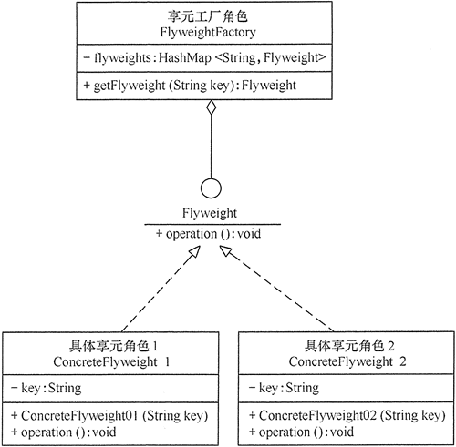

[TOC]

# 模式简介

- 通过共享对象固定属性，提高对象复用，降低内存消耗。

> 问题：享元模式是不是可以静态变量代替？


# 模式结构

- 抽象享元角色（Flyweight）：是所有的具体享元类的基类，为具体享元规范需要实现的公共接口，非享元的外部状态以参数的形式通过方法传入。
- 具体享元（Concrete Flyweight）：实现抽象享元角色中所规定的接口。
- 非享元（Unsharable Flyweight)：是不可以共享的外部状态，它以参数的形式注入具体享元的相关方法中。
- 享元工厂（Flyweight Factory）：负责创建和管理享元角色。当客户对象请求一个享元对象时，享元工厂检査系统中是否存在符合要求的享元对象，如果存在则提供给客户；如果不存在的话，则创建一个新的享元对象。


```cpp
// flyweight.cpp 享元模式
#include <string>
#include <iostream>
#include <unordered_map>
/**
 * Flyweight Design Pattern
 *
 * Intent: Lets you fit more objects into the available amount of RAM by sharing
 * common parts of state between multiple objects, instead of keeping all of the
 * data in each object.
 */

struct SharedState
{
    std::string brand_;
    std::string model_;
    std::string color_;

    SharedState(const std::string &brand, const std::string &model, const std::string &color)
        : brand_(brand), model_(model), color_(color)
    {
    }

    friend std::ostream &operator<<(std::ostream &os, const SharedState &ss)
    {
        return os << "[ " << ss.brand_ << " , " << ss.model_ << " , " << ss.color_ << " ]";
    }
};

struct UniqueState
{
    std::string owner_;
    std::string plates_;

    UniqueState(const std::string &owner, const std::string &plates)
        : owner_(owner), plates_(plates)
    {
    }

    friend std::ostream &operator<<(std::ostream &os, const UniqueState &us)
    {
        return os << "[ " << us.owner_ << " , " << us.plates_ << " ]";
    }
};

/**
 * The Flyweight stores a common portion of the state (also called intrinsic
 * state) that belongs to multiple real business entities. The Flyweight accepts
 * the rest of the state (extrinsic state, unique for each entity) via its
 * method parameters.
 */
class Flyweight
{
private:
    SharedState *shared_state_;

public:
    Flyweight(const SharedState *shared_state) : shared_state_(new SharedState(*shared_state))
    {
    }
    Flyweight(const Flyweight &other) : shared_state_(new SharedState(*other.shared_state_))
    {
    }
    ~Flyweight()
    {
        delete shared_state_;
    }
    SharedState *shared_state() const
    {
        return shared_state_;
    }
    void Operation(const UniqueState &unique_state) const
    {
        std::cout << "Flyweight: Displaying shared (" << *shared_state_ << ") and unique (" << unique_state << ") state.\n";
    }
};
/**
 * The Flyweight Factory creates and manages the Flyweight objects. It ensures
 * that flyweights are shared correctly. When the client requests a flyweight,
 * the factory either returns an existing instance or creates a new one, if it
 * doesn't exist yet.
 */
class FlyweightFactory
{
    /**
     * @var Flyweight[]
     */
private:
    std::unordered_map<std::string, Flyweight> flyweights_;
    /**
     * Returns a Flyweight's string hash for a given state.
     */
    std::string GetKey(const SharedState &ss) const
    {
        return ss.brand_ + "_" + ss.model_ + "_" + ss.color_;
    }

public:
    FlyweightFactory(std::initializer_list<SharedState> share_states)
    {
        for (const SharedState &ss : share_states)
        {
            this->flyweights_.insert(std::make_pair<std::string, Flyweight>(this->GetKey(ss), Flyweight(&ss)));
        }
    }

    /**
     * Returns an existing Flyweight with a given state or creates a new one.
     */
    Flyweight GetFlyweight(const SharedState &shared_state)
    {
        std::string key = this->GetKey(shared_state);
        if (this->flyweights_.find(key) == this->flyweights_.end())
        {
            std::cout << "FlyweightFactory: Can't find a flyweight, creating new one.\n";
            this->flyweights_.insert(std::make_pair(key, Flyweight(&shared_state)));
        }
        else
        {
            std::cout << "FlyweightFactory: Reusing existing flyweight.\n";
        }
        return this->flyweights_.at(key);
    }
    void ListFlyweights() const
    {
        size_t count = this->flyweights_.size();
        std::cout << "\nFlyweightFactory: I have " << count << " flyweights:\n";
        for (std::pair<std::string, Flyweight> pair : this->flyweights_)
        {
            std::cout << pair.first << "\n";
        }
    }
};

// ...
void AddCarToPoliceDatabase(
    FlyweightFactory &ff, const std::string &plates, const std::string &owner,
    const std::string &brand, const std::string &model, const std::string &color)
{
    std::cout << "\nClient: Adding a car to database.\n";
    const Flyweight &flyweight = ff.GetFlyweight({brand, model, color});
    // The client code either stores or calculates extrinsic state and passes it
    // to the flyweight's methods.
    flyweight.Operation({owner, plates});
}

/**
 * The client code usually creates a bunch of pre-populated flyweights in the
 * initialization stage of the application.
 */

int main()
{
    FlyweightFactory *factory = new FlyweightFactory({{"Chevrolet", "Camaro2018", "pink"}, {"Mercedes Benz", "C300", "black"}, {"Mercedes Benz", "C500", "red"}, {"BMW", "M5", "red"}, {"BMW", "X6", "white"}});
    factory->ListFlyweights();

    AddCarToPoliceDatabase(*factory,
                            "CL234IR",
                            "James Doe",
                            "BMW",
                            "M5",
                            "red");

    AddCarToPoliceDatabase(*factory,
                            "CL234IR",
                            "James Doe",
                            "BMW",
                            "X1",
                            "red");
    factory->ListFlyweights();
    delete factory;

    return 0;
}
```

输出

```shell
[root@QingYun build]# ./flyweight 

FlyweightFactory: I have 5 flyweights:
BMW_X6_white
Mercedes Benz_C300_black
Chevrolet_Camaro2018_pink
Mercedes Benz_C500_red
BMW_M5_red

Client: Adding a car to database.
FlyweightFactory: Reusing existing flyweight.
Flyweight: Displaying shared ([ BMW , M5 , red ]) and unique ([ James Doe , CL234IR ]) state.

Client: Adding a car to database.
FlyweightFactory: Can't find a flyweight, creating new one.
Flyweight: Displaying shared ([ BMW , X1 , red ]) and unique ([ James Doe , CL234IR ]) state.

FlyweightFactory: I have 6 flyweights:
BMW_X6_white
Mercedes Benz_C300_black
BMW_X1_red
Chevrolet_Camaro2018_pink
Mercedes Benz_C500_red
BMW_M5_red
```

> 例子连接：https://refactoringguru.cn/design-patterns/flyweight/cpp/example

# 模式的优缺点

## 优点

- 相同对象只要保存一份，有效节省系统资源

## 缺点

- 为了使对象可以共享，需要将一些不能共享的状态外部化，这将增加程序的复杂性。

- 读取享元模式的外部状态会使得运行时间稍微变长。


# 应用场景

- 系统中存在大量相同或相似的对象，这些对象耗费大量的内存资源。

- 大部分的对象可以按照内部状态进行分组，且可将不同部分外部化，这样每一个组只需保存一个内部状态。

- 由于享元模式需要额外维护一个保存享元的[数据结构](http://c.biancheng.net/data_structure/)，所以应当在有足够多的享元实例时才值得使用享元模式。


# 模式扩展

在前面介绍的享元模式中，其结构图通常包含可以共享的部分和不可以共享的部分。在实际使用过程中，有时候会稍加改变，即存在两种特殊的享元模式：单纯享元模式和复合享元模式，下面分别对它们进行简单介绍。

单纯享元模式，这种享元模式中的所有的具体享元类都是可以共享的，不存在非共享的具体享元类，其结构图如图所示：




复合享元模式，这种享元模式中的有些享元对象是由一些单纯享元对象组合而成的，它们就是复合享元对象。虽然复合享元对象本身不能共享，但它们可以分解成单纯享元对象再被共享，其结构图如图所示：

​	


# 与其他模式的关系

- 你可以使用[享元模式](https://refactoringguru.cn/design-patterns/flyweight)实现[组合模式](https://refactoringguru.cn/design-patterns/composite)树的共享叶节点以节省内存。
- [享元](https://refactoringguru.cn/design-patterns/flyweight)展示了如何生成大量的小型对象， [外观模式](https://refactoringguru.cn/design-patterns/facade)则展示了如何用一个对象来代表整个子系统。
- 如果你能将对象的所有共享状态简化为一个享元对象， 那么[享元](https://refactoringguru.cn/design-patterns/flyweight)就和[单例模式](https://refactoringguru.cn/design-patterns/singleton)类似了。 但这两个模式有两个根本性的不同。
  1. 只会有一个单例实体， 但是*享元*类可以有多个实体， 各实体的内在状态也可以不同。
  2. *单例*对象可以是可变的。 享元对象是不可变的。