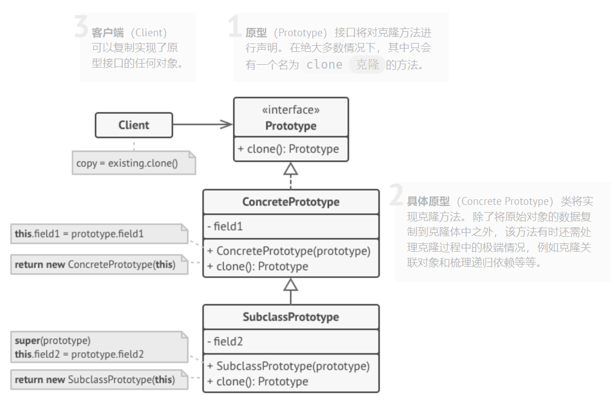
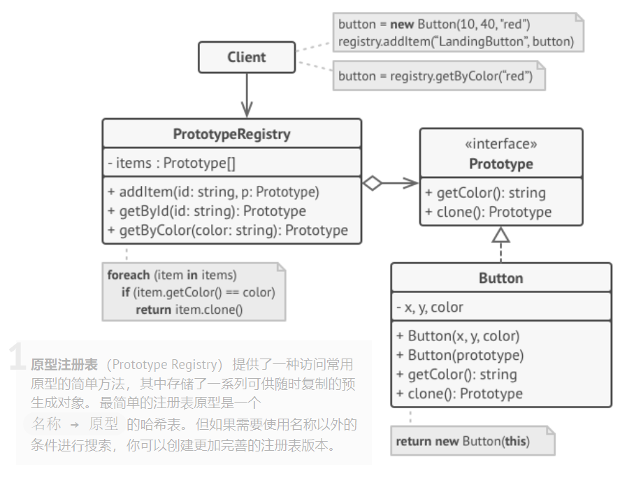

[TOC]

**`原型模式`** 是一种创建型设计模式， 使你能够复制已有对象， 而又无需使代码依赖它们所属的类。

之所以使用`原型模式`，是因为直接复制一个对象可能存在以下两个问题：

- 并非所有对象都能通过这种方式进行复制， 因为有些对象可能拥有私有成员变量， 它们在对象本身以外是不可见的。

- 直接复制还有另外一个问题。 因为你必须知道对象所属的类才能创建复制品， 所以代码必须依赖该类。 即使你可以接受额外的依赖性， 那还有另外一个问题： 有时你只知道对象所实现的接口， 而不知道其所属的具体类， 比如可向方法的某个参数传入实现了某个接口的任何对象。


原型模式将克隆过程委派给被克隆的实际对象。 模式为所有支持克隆的对象声明了一个通用接口， 该接口让你能够克隆对象， 同时又无需将代码和对象所属类耦合。 通常情况下， 这样的接口中仅包含一个 `克隆`方法。

支持克隆的对象即为 `原型`。 当你的对象有几十个成员变量和几百种类型时， 对其进行克隆甚至可以代替子类的构造。

其运作方式如下： 创建一系列不同类型的对象并不同的方式对其进行配置。 如果所需对象与预先配置的对象相同， 那么你只需克隆原型即可， 无需新建一个对象。


# 原型模式基本实现



```cpp
// simple_prototype.cpp: 原型模式基本实现
#include <iostream>
using namespace std;

class Prototype  {
public:
    virtual Prototype* clone() const = 0;
};


class Keyboard : public Prototype {
private:
    string brand;           // 品牌
    string model;           // 型号
    float  prise;           // 零售价
    string identification;  // 唯一标识

public:
    Keyboard(const string& b, const string& m, float p, const string& id)
        : brand(b), model(m), prise(p), identification(id) { }
    
    void SetIdentification(const string& id) {
        identification = id;
    }

    Keyboard* clone() const override {
        Keyboard* res = new Keyboard(*this);
        return res;
    }

    void Show(){
        cout << "brand: " << brand << ", model: " << model << ", prise: " << prise
             << ", identification: " << identification << endl;
    }
};

int main(){
    Keyboard* keyboard1 = new Keyboard("iKBC", "V120", 100, "123-456-789");
    Keyboard* keyboard2 = keyboard1->clone();
    keyboard2->SetIdentification("123-456-790");
    
    keyboard1->Show();
    keyboard2->Show();
    return 0;
}

/** OUTPUT:
brand: iKBC, model: V120, prise: 100, identification: 123-456-789
brand: iKBC, model: V120, prise: 100, identification: 123-456-790
*/
```

> 在上述的例子中，因为同一批的产品除了 `唯一标识` 不一样其他属性都是一致的，使用原型设计模式则可以更快速构造大量实例对象。


# 原型模式注册表实现



```cpp
// prototype_registry.cpp: 原型模式注册表实现
// simple_prototype.cpp: 原型模式基本实现
#include <iostream>
#include <unordered_map>
using namespace std;

class Prototype  {
public:
    virtual Prototype* Clone() const = 0;
};


class Keyboard : public Prototype {
private:
    string brand;           // 品牌
    string model;           // 型号
    float  prise;           // 零售价
    string identification;  // 唯一标识

public:
    Keyboard(const string& b, const string& m, float p, const string& id)
        : brand(b), model(m), prise(p), identification(id) { }
    
    void SetIdentification(const string& id) {
        identification = id;
    }

    Keyboard* Clone() const override {
        Keyboard* res = new Keyboard(*this);
        return res;
    }

    void Show(){
        cout << "Keyboard: brand:" << brand << ", model:" << model << ", prise:" << prise
             << ", identification:" << identification << endl;
    }
};

class Monitor : public Prototype {
private:
    string brand;           // 品牌
    string model;           // 型号
    float  prise;           // 零售价
    string identification;  // 唯一标识

public:
    Monitor(const string& b, const string& m, float p, const string& id)
        : brand(b), model(m), prise(p), identification(id) { }
    
    void SetIdentification(const string& id) {
        identification = id;
    }

    Monitor* Clone() const override {
        Monitor* res = new Monitor(*this);
        return res;
    }

    void Show(){
        cout << "Monitor: brand:" << brand << ", model:" << model << ", prise:" << prise
             << ", identification:" << identification << endl;
    }
};

class PrototypeRegistry {
private:
    unordered_map<string, Prototype*> PrototypeMap;
public:
    void AddPrototype(const string& type, Prototype* prototype){
        PrototypeMap[type] = prototype;
    }
    Prototype* CreatePrototype(const string& type){
        return (PrototypeMap[type]->Clone());
    }
};

int main(){
    PrototypeRegistry* prototypeRegistry= new PrototypeRegistry();
    Monitor* monitor1 = new Monitor("Dell", "V120", 800, "0-123-456-789");
    Keyboard* keyboard1 = new Keyboard("iKBC", "X120", 100, "1-123-456-789");
    
    prototypeRegistry->AddPrototype("Monitor", monitor1);
    prototypeRegistry->AddPrototype("Keyboard", keyboard1);

    Monitor* monitor2 = (Monitor*)prototypeRegistry->CreatePrototype("Monitor");
    Keyboard* keyboard2 = (Keyboard*)prototypeRegistry->CreatePrototype("Keyboard");
    monitor2->SetIdentification("0-123-456-790");
    keyboard2->SetIdentification("1-123-456-790");

    monitor1->Show();
    monitor2->Show();

    keyboard1->Show();
    keyboard2->Show();
    return 0;
}

/** OUTPUT:
Monitor: brand:Dell, model:V120, prise:800, identification:0-123-456-789
Monitor: brand:Dell, model:V120, prise:800, identification:0-123-456-790
Keyboard: brand:iKBC, model:X120, prise:100, identification:1-123-456-789
Keyboard: brand:iKBC, model:X120, prise:100, identification:1-123-456-790
*/
```

> 原型模式注册表实现为带原型管理器的原型模式，它在原型模式的基础上增加了一个原型注册表`PrototypeRegistry` 类。该类用  `Map`  保存多个复制的原型，代码中可以通过注册表的 `CreatePrototype(const string& type)` 方法从中获取复制的原型。


参考链接：http://c.biancheng.net/view/1343.html

参考链接：https://refactoringguru.cn/design-patterns/prototype

参考链接：https://www.w3cschool.cn/shejimoshi/prototype-pattern.html

参考链接：https://www.runoob.com/design-pattern/prototype-pattern.html

