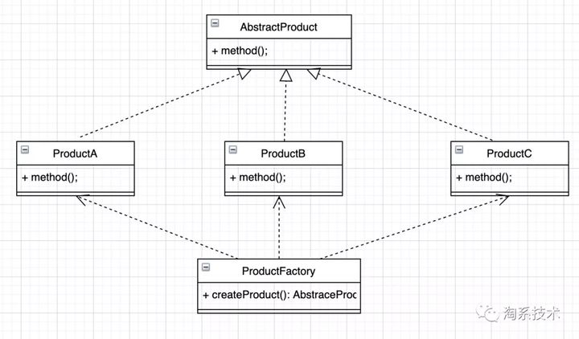
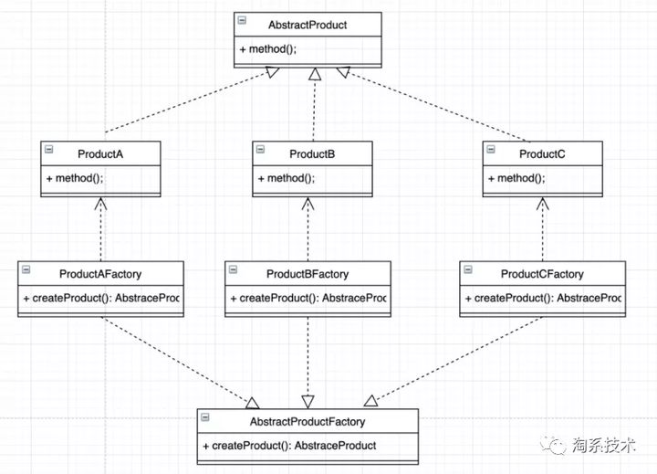
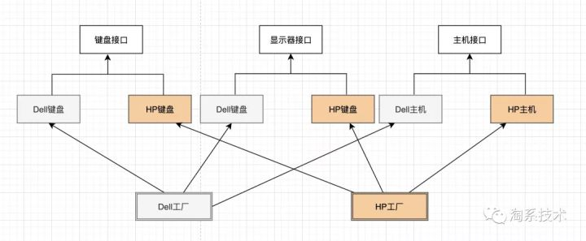
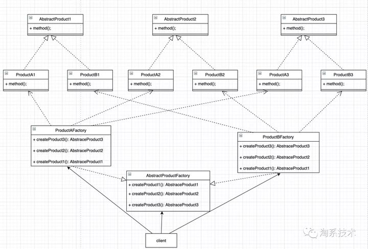

[TOC]

工厂模式的定义：定义一个创建产品对象的工厂接口，将产品对象的实际创建工作推迟到具体子工厂类当中。这满足创建型模式中所要求的“创建与使用相分离”的特点。

# 简单工厂模式

## 模式简介

- 一个包含大量条件语句的构建方法的工厂类，根据方法的参数来选择对何种产品进行初始化并将其返回。

简单工厂模式不在 GoF 23 种设计模式之列。



示例：

```cpp
// simple_factory.cpp
// 简单工厂模式
#include<iostream>
using namespace std;

enum Keyboard_ID{
	HPKeyboard_ID = 0,
	DellKeyboard_ID = 1,
};

// H键盘
class Keyboard {
public:
	void print(){};
    void input(string context);
};
// HP键盘
class HPKeyboard : public Keyboard {
public:
	void print() { cout << "HPKeyboard print()" << endl; };
    void input(string context);
};
// DELL键盘
class DellKeyboard : public Keyboard {
public:
	void print(){cout << "DellKeyboard print()"<< endl;};
    void input(string context);
};

// 工厂类
class KeyboardFactory {
public:
    // 构造方法
	static Keyboard* CreateKeyboard(int id) {
		Keyboard* keyboard = nullptr;
		switch (id) {
			case Keyboard_ID::HPKeyboard_ID:
				keyboard = new HPKeyboard();
				break;
			case Keyboard_ID::DellKeyboard_ID:
				keyboard = new DellKeyboard();
				break;
			default:
				break;
		}
		return keyboard;
	}
};

int main() {
	HPKeyboard* ka = (HPKeyboard*)KeyboardFactory::CreateKeyboard(Keyboard_ID::HPKeyboard_ID);
	DellKeyboard* kb = (DellKeyboard*)KeyboardFactory::CreateKeyboard(Keyboard_ID::DellKeyboard_ID);
	ka->print();
	kb->print();
	return 0;
}

/** OUTPUT:
HPKeyboard print()
DellKeyboard print()
*/	
```

>   **缺陷**
>
>   上面的工厂实现是一个具体的类KeyboardFactory，而非接口或者抽象类，getInstance()方法利用[if-else](https://www.zhihu.com/search?q=if-else&search_source=Entity&hybrid_search_source=Entity&hybrid_search_extra={"sourceType"%3A"answer"%2C"sourceId"%3A1615074467})创建并返回具体的键盘实例，如果增加新的键盘子类，键盘工厂的创建方法中就要增加新的if-else。这种做法扩展性差，违背了开闭原则，也影响了可读性。所以，这种方式使用在业务较简单，工厂类不会经常更改的情况。


# 工厂方法模式

## 模式简介

- 每个具体产品实现一个具体工厂类，反之，每个工厂类只负责构建一种具体产品。

为了解决上面提到的"增加if-else"的问题，可以为每一个键盘子类建立一个对应的工厂子类，这些工厂子类实现同一个抽象工厂接口。这样，创建不同品牌的键盘，只需要实现不同的工厂子类。当有新品牌加入时，新建具体工厂继承抽象工厂，而不用修改任何一个类。




- 抽象工厂类：声明了工厂方法的接口。
- 具体工厂类：实现工厂方法的接口，负责创建产品对象。
- 抽象产品类：定义产品对象的接口。
- 具体产品类：具有统一父类的具体类型的产品。

示例：

```cpp
// factory_method.cpp
// 工厂方法模式
#include<iostream>
using namespace std;

// HP键盘
class Keyboard {
public:
	void print(){};
    void input(string context);
};
// HP键盘
class HPKeyboard : public Keyboard {
public:
	void print() { cout << "HPKeyboard print()" << endl; };
    void input(string context);
};
// DELL键盘
class DellKeyboard : public Keyboard {
public:
	void print(){cout << "DellKeyboard print()"<< endl;};
    void input(string context);
};

// 抽象工厂类
class KeyboardFactory {
public:
    static Keyboard* CreateKeyboard();
};

class HPKeyboardFactory : public KeyboardFactory {
public:
    static Keyboard* CreateKeyboard(){
        return new HPKeyboard();
    }
};

class DellKeyboardFactory : public KeyboardFactory {
public:
    static Keyboard* CreateKeyboard(){
        return new DellKeyboard();
    }
};

int main() {
    HPKeyboard* ka = (HPKeyboard*)HPKeyboardFactory::CreateKeyboard();
    DellKeyboard* kb = (DellKeyboard*)DellKeyboardFactory::CreateKeyboard();

	ka->print();
	kb->print();
	return 0;
}

/** OUTPUT:
HPKeyboard print()
DellKeyboard print()
*/
```

> **缺点**
>
> 每一种品牌对应一个工厂子类，在创建具体键盘对象时，实例化不同的工厂子类。但是，如果业务涉及的子类越来越多，难道每一个子类都要对应一个工厂类吗？这样会使得系统中类的个数成倍增加，增加了代码的复杂度。


# 抽象工厂模式

- 一组具体产品类共用一个工厂类，反之，一个工厂类可以构造一组具体产品类

为了缩减工厂实现子类的数量，不必给每一个产品分配一个工厂类，可以将产品进行分组，每组中的不同产品由同一个工厂类的不同方法来创建。
例如，键盘、主机这2种产品可以分到同一个分组——电脑，而不同品牌的电脑由不同的制造商工厂来创建。



类似这种把产品类分组，组内不同产品由同一工厂类的不同方法实现的设计模式，就是抽象工厂模式。

抽象工厂适用于以下情况：

1. 一个系统要独立于它的产品的创建、组合和表示时；
2. 一个系统要由多个[产品系列](https://www.zhihu.com/search?q=产品系列&search_source=Entity&hybrid_search_source=Entity&hybrid_search_extra={"sourceType"%3A"answer"%2C"sourceId"%3A1615074467})中的一个来配置时；
3. 要强调一系列相关的产品对象的设计以便进行联合使用时；
4. 当你提供一个[产品类库](https://www.zhihu.com/search?q=产品类库&search_source=Entity&hybrid_search_source=Entity&hybrid_search_extra={"sourceType"%3A"answer"%2C"sourceId"%3A1615074467})，而只想显示它们的接口而不是实现时；



```cpp
// abstract_factory.cpp
// 抽象工厂模式
#include<iostream>
using namespace std;

// 键盘
class Keyboard {
public:
	void print(){};
    void input(string context);
};
// HP键盘
class HPKeyboard : public Keyboard {
public:
	void print() { cout << "HPKeyboard print()" << endl; };
    void input(string context);
};
// DELL键盘
class DellKeyboard : public Keyboard {
public:
	void print(){cout << "DellKeyboard print()"<< endl;};
    void input(string context);
};

// 显示器
class Monitor {
public:
	void play(){};
};
// HP显示器
class HPMonitor : public Monitor {
public:
	void play() { cout << "HPMonitor play()" << endl; };
};
// DELL显示器
class DellMonitor : public Monitor {
public:
	void play(){cout << "DellMonitor play()"<< endl;};
};

// 主机
class MainFrame {
public:
	void run(){};
};
// HP主机
class HPMainFrame : public MainFrame {
public:
	void run() { cout << "HPMainFrame run()" << endl; };
};
// DELL主机
class DellMainFrame : public MainFrame {
public:
	void run(){cout << "DellMainFrame run()"<< endl;};
};

// 抽象工厂类
class Factory {
public:
    static MainFrame* CreateMainFrame();
    static Monitor* CreateMonitor();
    static Keyboard* CreateKeyboard();
};
//HP工厂
class HPFactory : public Factory {
public:
    static MainFrame* CreateMainFrame(){
        return new HPMainFrame();
    }
    static Monitor* CreateMonitor(){
        return new HPMonitor();
    }
    static Keyboard* CreateKeyboard(){
        return new HPKeyboard();
    }
};
//Dell工厂
class DellFactory : public Factory {
public:
    static MainFrame* CreateMainFrame(){
        return new DellMainFrame();
    }
    static Monitor* CreateMonitor(){
        return new DellMonitor();
    }
    static Keyboard* CreateKeyboard(){
        return new DellKeyboard();
    }
};

int main() {
    Factory hpFactory = HPFactory();
    Factory dellFactory = DellFactory();

    ((HPKeyboard*)HPFactory::CreateKeyboard())->print();
    ((HPMainFrame*)HPFactory::CreateMainFrame())->run();
    ((HPMonitor*)HPFactory::CreateMonitor())->play();

    ((DellKeyboard*)DellFactory::CreateKeyboard())->print();
    ((DellMainFrame*)DellFactory::CreateMainFrame())->run();
    ((DellMonitor*)DellFactory::CreateMonitor())->play();
	return 0;
}

/** OUTPUT:
HPKeyboard print()
HPMainFrame run()
HPMonitor play()
DellKeyboard print()
DellMainFrame run()
DellMonitor play()
*/
```

> 增加分组非常简单，例如要增加Lenovo分组，只需创建Lenovo工厂和具体的产品实现类。分组中的产品扩展非常困难，要增加一个[鼠标Mouse](https://www.zhihu.com/search?q=鼠标Mouse&search_source=Entity&hybrid_search_source=Entity&hybrid_search_extra={"sourceType"%3A"answer"%2C"sourceId"%3A1615074467})，既要创建抽象的Mouse接口, 又要增加具体的实现：DellMouse、HPMouse， 还要再每个Factory中定义创建鼠标的方法实现。


总结：

- 简单工厂：唯一工厂类，一个产品抽象类，工厂类的创建方法依据入参判断并创建具体产品对象。
- 工厂方法：多个工厂类，一个产品抽象类，利用多态创建不同的产品对象，避免了大量的if-else判断。
- 抽象工厂：多个工厂类，多个产品抽象类，产品子类分组，同一个工厂实现类创建同组中的不同产品，减少了工厂子类的数量。

在下述情况下可以考虑使用工厂模式：

1. 在编码时不能预见需要创建哪种类的实例。
2. 系统不应依赖于产品类实例如何被创建、组合和表达的细节。

总之，工厂模式就是为了方便创建同一接口定义的具有复杂参数和初始化步骤的不同对象。工厂模式一般用来创建复杂对象。只需用new就可以创建成功的简单对象，无需使用工厂模式，否则会增加系统的复杂度。

此外，如果对象的参数是不固定的，推荐使用Builder模式。


参考链接：https://www.zhihu.com/question/27125796/answer/1615074467

