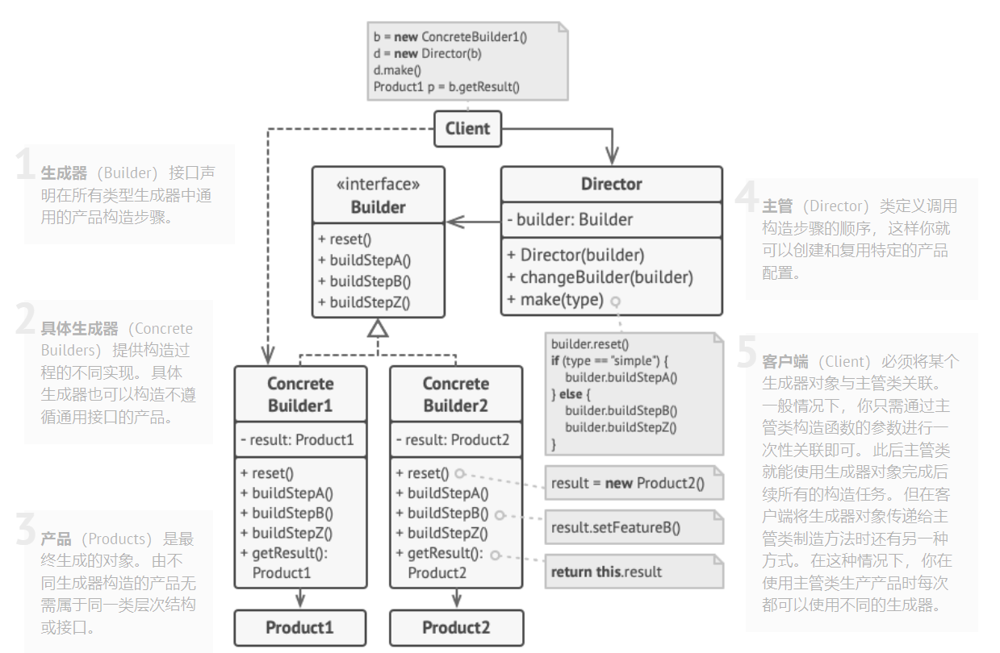

### 模式简介

- 和抽象工厂模式很像

建造者模式，也称生成器模式。

`建造者模式` 和 `工厂模式` 的关注点不同：`建造者模式` 注重零部件的组装过程，而 `工厂方法模式` 更注重零部件的创建过程，但两者可以结合使用。

建造者模式由产品、抽象建造者、具体建造者、指挥者等 4 个要素构成:

- 产品角色（Product）：它是包含多个组成部件的复杂对象，由具体建造者来创建其各个零部件。
- 抽象建造者（Builder）：它是一个包含创建产品各个子部件的抽象方法的接口，通常还包含一个返回复杂产品的方法 getResult()。
- 具体建造者(Concrete Builder）：实现 Builder 接口，完成复杂产品的各个部件的具体创建方法。
- 指挥者（Director）：它调用建造者对象中的部件构造与装配方法完成复杂对象的创建，在指挥者中不涉及具体产品的信息。



```cpp
// builder.cpp
// 建造者模式
#include<iostream>
using namespace std;

// 键盘
class Keyboard {
    string brand = "";  // 品牌

public:
    Keyboard(const string& b):brand(b){}
    void Show(){ cout << "    Keyboard: " << brand << endl; }
};

// 显示器
class Monitor {
    string brand = "";  // 品牌

public:
    Monitor(const string& b):brand(b){}
    void Show(){cout << "    Monitor: " << brand << endl;}
};
// 主机
class MainFrame {
    string brand = "";  // 品牌

public:
    MainFrame(const string& b):brand(b){}
    void Show(){ cout << "    MainFrame: " << brand << endl; }
};

// 产品
class Computer{
public:
    Monitor* monitor = nullptr;
    Keyboard* keyboard = nullptr;
    MainFrame* mainFrame = nullptr;

    ~Computer(){
        if(monitor) delete monitor;
        if(keyboard) delete keyboard;
        if(mainFrame) delete mainFrame;
    }
    void Show(){
        if(monitor) monitor->Show();
        if(keyboard) keyboard->Show();
        if(mainFrame) mainFrame->Show();
    }
};

// 抽象生成器
class Builder{
public:
    Computer* computer = nullptr;
    Builder(){
        computer = new Computer();
    }
    ~Builder(){
        if(computer) delete computer;
    }
    Computer* GetComputer(){
        return computer;
    }
    virtual void BuildMonitor() = 0;
    virtual void BuildKeyboard() = 0;
    virtual void BuildMainFrame() = 0;
};

// HP电脑生成器
class HPBuilder: public Builder{
public:
    void BuildMonitor() override {
        computer->monitor = new Monitor("HP");
    }
    void BuildKeyboard() override {
        computer->keyboard = new Keyboard("HP");
    }
    void BuildMainFrame() override {
        computer->mainFrame = new MainFrame("HP");
    }
};

// Dell电脑生成器
class DellBuilder: public Builder{
public:
    void BuildMonitor() override {
        computer->monitor = new Monitor("Dell");
    }
    void BuildKeyboard() override {
        computer->keyboard = new Keyboard("Dell");
    }
    void BuildMainFrame() override {
        computer->mainFrame = new MainFrame("Dell");
    }
};

// 定制电脑生成器
class CustomBuilder: public Builder{
public:
    void BuildMonitor() override {
        computer->monitor = new Monitor("Dell");
    }
    void BuildKeyboard() override {
        computer->keyboard = new Keyboard("HP");
    }
    void BuildMainFrame() override {
        computer->mainFrame = new MainFrame("Other");
    }
};

// 生成指导者
class Director{
public:
    void MakeHPComputer(HPBuilder* builder){
        builder->BuildMainFrame();
        builder->BuildKeyboard();
        builder->BuildMonitor();
    }

    void MakeDellComputer(DellBuilder* builder){
        builder->BuildMainFrame();
        builder->BuildKeyboard();
        builder->BuildMonitor();
    }

    void MakeCustomComputer(CustomBuilder* builder){
        builder->BuildMainFrame();
        builder->BuildKeyboard();
        builder->BuildMonitor();
    }
};


int main(){
    Director* director = new Director();
    HPBuilder* hpBuilder = new HPBuilder();
    DellBuilder* dellBuilder = new DellBuilder();
    CustomBuilder* customBuilder = new CustomBuilder();

    director->MakeHPComputer(hpBuilder);
    Computer* computer1 = hpBuilder->GetComputer();
    cout << "Computer1 Show():" << endl;
    computer1->Show();
    cout << endl;

    director->MakeDellComputer(dellBuilder);
    Computer* computer2 = dellBuilder->GetComputer();
    cout << "Computer2 Show():" << endl;
    computer2->Show();
    cout << endl;

    director->MakeCustomComputer(customBuilder);
    Computer* computer3 = customBuilder->GetComputer();
    cout << "Computer3 Show():" << endl;
    computer3->Show();
    return 0;
}

/** OUTPUT:
Computer1 Show():
    Monitor: HP
    Keyboard: HP
    MainFrame: HP

Computer2 Show():
    Monitor: Dell
    Keyboard: Dell
    MainFrame: Dell

Computer3 Show():
    Monitor: Dell
    Keyboard: HP
    MainFrame: Other
*/
```

> 生成器模式可以通过类来识别， 它拥有一个构建方法和多个配置结果对象的方法。 生成器方法通常支持方法链 （例如 `someBuilder->setValueA(1)->setValueB(2)->create()` ）

> 疑问
>
> 1.示例代码中存在很多重复的代码，如果从`生成指导者`传入参数的话，似乎只要一个构造者就可以？
>
> 2.这种模式是否可以直接使用Getter/Setter即可？

