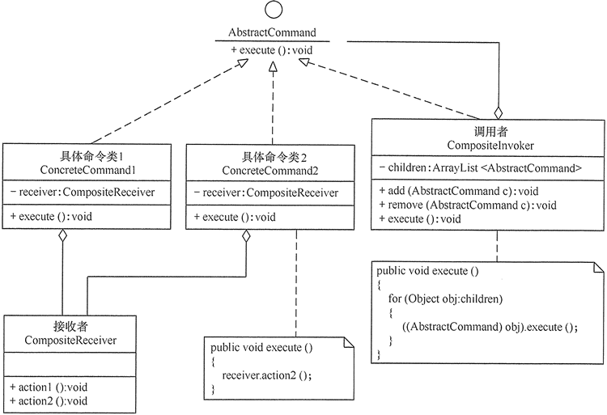

[TOC]

# 模式简介

- 一种行为设计模式， 目的是将请求或简单操作转换为一个对象。


# 模式结构

- 抽象命令类（Command）：声明执行命令的接口，拥有执行命令的抽象方法 execute()。
- 具体命令类（Concrete Command）：是抽象命令类的具体实现类，它拥有接收者对象，并通过调用接收者的功能来完成命令要执行的操作。
- 实现者/接收者（Receiver）：执行命令功能的相关操作，是具体命令对象业务的真正实现者。
- 调用者/请求者（Invoker）：是请求的发送者，它通常拥有很多的命令对象，并通过访问命令对象来执行相关请求，它不直接访问接收者。


```cpp
// command.cpp 命令模式
#include <vector>
#include <iostream>
using namespace std;

// 接受者类
class Editor{
    string data = "";
public:
    void Save(){
        cout << "Save: " << data << endl;
    }
    void Insert(int pos, const string& s){
        data = data.substr(0, pos) + s + data.substr(pos);
    }
    string Cut (int start, int len){
        string res = data.substr(start, len);
        data = data.substr(0, start) + data.substr(start+len);
        return res;
    }
    void Paste(int pos, const string& s){
        data = data.substr(0, pos) + s + data.substr(pos);
    }
};

// 调用者类
class Application{
    vector<Editor*> editors;
    string clipboard;

public:
    void SetClipboard(const string& s){
        clipboard = s;
    }
    string GetClipboard(){
        return clipboard;
    }
    Editor* OpenNewEditor(){
        Editor* editor = new Editor;
        editors.push_back(editor);
        return editor;
    }
};

// 抽象命令类
class Command{
protected:
    Editor* editor;
    Application* app;

public:
    Command(Application* a, Editor* e) : app(a), editor(e){}

    virtual void execute() = 0;
};

// 具体命令类：保存
class SaveCommand : public Command{
public:
    SaveCommand(Application* a, Editor* e) : Command(a, e){}

    void execute() override {
        editor->Save();
    }
};
// 具体命令类：插入
class InsertCommand : public Command{
private:
    int pos;
    string context;
public:
    InsertCommand(Application* a, Editor* e, int p, const string& c) : pos(p), context(c), Command(a, e){}

    void execute() override {
        editor->Insert(pos, context);
    }
};
// 具体命令类：剪切
class CutCommand : public Command{
private:
    int start, len;
public:
    CutCommand(Application* a, Editor* e, int s, int l) : start(s), len(l), Command(a, e) {}

    void execute() override {
        app->SetClipboard(editor->Cut(start, len));
    }
};
// 具体命令类：粘贴
class PasteCommand : public Command{
    int pos;
public:
    PasteCommand(Application* a, Editor* e, int p): pos(p), Command(a, e) {}

    void execute() override {
        editor->Paste(pos, app->GetClipboard());
    }
};


void DoSomethins(Application* app, Editor* editor){
    Command* sm = new SaveCommand(app, editor);
    sm->execute();


    Command* im = new InsertCommand(app, editor, 0, "0126734589");
    im->execute();
    sm->execute();
    
    cout << "cut(7, 5)" << endl;
    Command* cm = new CutCommand(app, editor, 3, 2);
    cm->execute();
    sm->execute();

    cout << "paste(6)" << endl;
    Command* pm = new PasteCommand(app, editor, 6);
    pm->execute();
    sm->execute();
}


int main(){
    Application* app = new Application;
    Editor* editor = app->OpenNewEditor();

    DoSomethins(app, editor);
    return 0;
}
```

输出

```shell
[root@QingYun build]# ./command 
Save: 
Save: 0126734589
cut(7, 5)
Save: 01234589
paste(7, 5)
Save: 0123456789
```


## 模式扩展

在软件开发中，有时将命令模式与前面学的组合模式联合使用，这就构成了宏命令模式，也叫组合命令模式。宏命令包含了一组命令，它充当了具体命令与调用者的双重角色，执行它时将递归调用它所包含的所有命令，其具体结构图如图所示。




# 应用场景

当系统的某项操作具备命令语义，且命令实现不稳定（变化）时，可以通过命令模式解耦请求与实现。使用抽象命令接口使请求方的代码架构稳定，封装接收方具体命令的实现细节。接收方与抽象命令呈现弱耦合（内部方法无需一致），具备良好的扩展性。

命令模式通常适用于以下场景。

- 请求调用者需要与请求接收者解耦时，命令模式可以使调用者和接收者不直接交互。

- 系统随机请求命令或经常增加、删除命令时，命令模式可以方便地实现这些功能。

- 当系统需要执行一组操作时，命令模式可以定义宏命令来实现该功能。
- 当系统需要支持命令的撤销（Undo）操作和恢复（Redo）操作时，可以将命令对象存储起来，采用备忘录模式来实现。


# 模式优缺点

## 优点

- 通过引入中间件（抽象接口）降低系统的耦合度。
- 扩展性良好，增加或删除命令非常方便。采用命令模式增加与删除命令不会影响其他类，且满足“开闭原则”。
- 可以实现宏命令。命令模式可以与[组合模式](http://c.biancheng.net/view/1373.html)结合，将多个命令装配成一个组合命令，即宏命令。
- 方便实现 Undo 和 Redo 操作。命令模式可以与后面介绍的[备忘录模式](http://c.biancheng.net/view/1400.html)结合，实现命令的撤销与恢复。
- 可以在现有命令的基础上，增加额外功能。比如日志记录，结合装饰器模式会更加灵活。

## 缺点

- 可能产生大量具体的命令类。因为每一个具体操作都需要设计一个具体命令类，这会增加系统的复杂性。
- 命令模式的结果其实就是接收方的执行结果，但是为了以命令的形式进行架构、解耦请求与实现，引入了额外类型结构（引入了请求方与抽象命令接口），增加了理解上的困难。不过这也是[设计模式](http://c.biancheng.net/design_pattern/)的通病，抽象必然会额外增加类的数量，代码抽离肯定比代码聚合更加难理解。


# 与其他模式的关系

- [责任链模式](https://refactoringguru.cn/design-patterns/chain-of-responsibility)、 [命令模式](https://refactoringguru.cn/design-patterns/command)、 [中介者模式](https://refactoringguru.cn/design-patterns/mediator)和[观察者模式](https://refactoringguru.cn/design-patterns/observer)用于处理请求发送者和接收者之间的不同连接方式：

  - *责任链*按照顺序将请求动态传递给一系列的潜在接收者， 直至其中一名接收者对请求进行处理。
  - *命令*在发送者和请求者之间建立单向连接。
  - *中介者*清除了发送者和请求者之间的直接连接， 强制它们通过一个中介对象进行间接沟通。
  - *观察者*允许接收者动态地订阅或取消接收请求。

- [责任链](https://refactoringguru.cn/design-patterns/chain-of-responsibility)的管理者可使用[命令模式](https://refactoringguru.cn/design-patterns/command)实现。 在这种情况下， 你可以对由请求代表的同一个上下文对象执行许多不同的操作。

  还有另外一种实现方式， 那就是请求自身就是一个*命令*对象。 在这种情况下， 你可以对由一系列不同上下文连接而成的链执行相同的操作。

- 你可以同时使用[命令](https://refactoringguru.cn/design-patterns/command)和[备忘录模式](https://refactoringguru.cn/design-patterns/memento)来实现 “撤销”。 在这种情况下， 命令用于对目标对象执行各种不同的操作， 备忘录用来保存一条命令执行前该对象的状态。

- [命令](https://refactoringguru.cn/design-patterns/command)和[策略模式](https://refactoringguru.cn/design-patterns/strategy)看上去很像， 因为两者都能通过某些行为来参数化对象。 但是， 它们的意图有非常大的不同。

  - 你可以使用*命令*来将任何操作转换为对象。 操作的参数将成为对象的成员变量。 你可以通过转换来延迟操作的执行、 将操作放入队列、 保存历史命令或者向远程服务发送命令等。
  - 另一方面， *策略*通常可用于描述完成某件事的不同方式， 让你能够在同一个上下文类中切换算法。

- [原型模式](https://refactoringguru.cn/design-patterns/prototype)可用于保存[命令](https://refactoringguru.cn/design-patterns/command)的历史记录。

- 你可以将[访问者模式](https://refactoringguru.cn/design-patterns/visitor)视为[命令模式](https://refactoringguru.cn/design-patterns/command)的加强版本， 其对象可对不同类的多种对象执行操作。