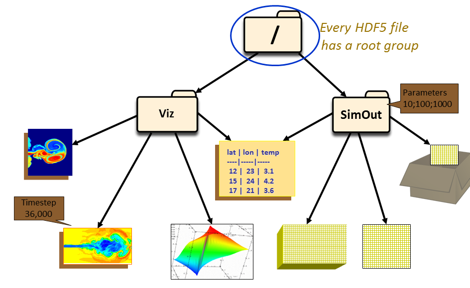
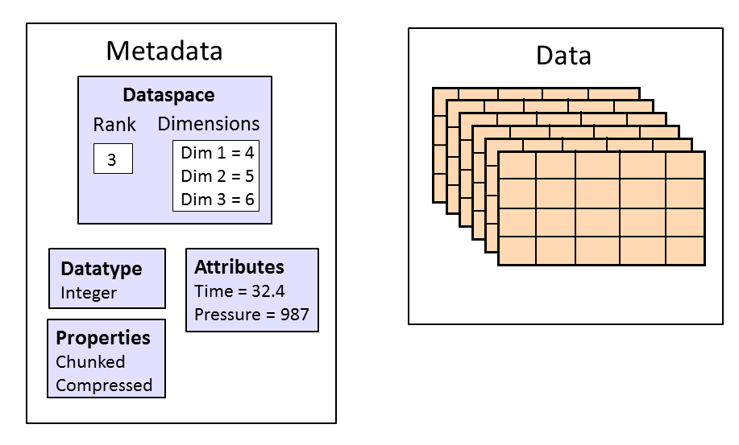
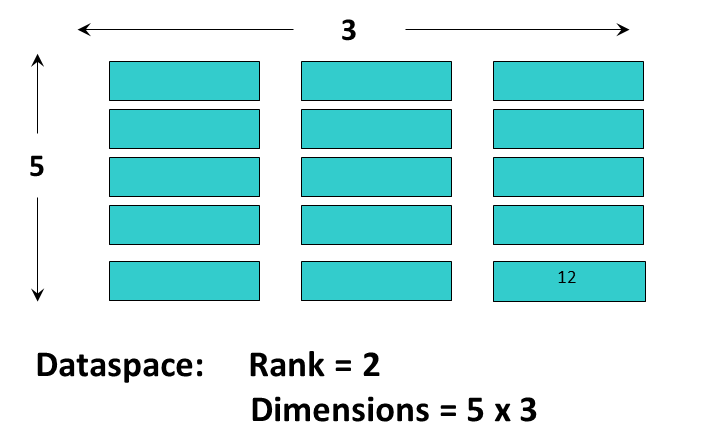
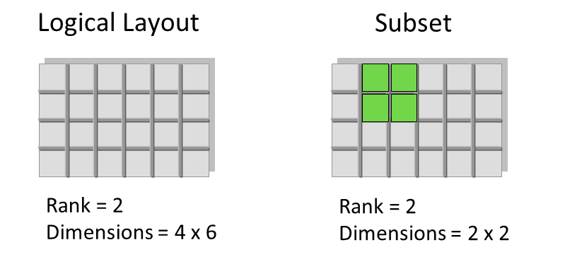
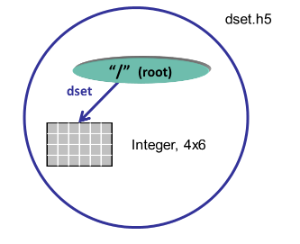

# HDF5

**层级数据格式**（Hierarchical Data Format：**HDF**）是设计用来存储和组织大量数据的一组文件格式（**HDF4**，**HDF5**）。它最初开发于美国[国家超级计算应用中心](https://zh.wikipedia.org/wiki/国家超级电脑应用中心)，现在由非营利社团HDF Group支持，其任务是确保HDF5技术的持续开发和存储在HDF中数据的持续可访问性。


## HDF5组成

- **HDF5 group:** 包含多个HDF5数据对象/元数据的组织结构，类似文件管理的数据组织形式



> There are two groups in the HDF5 file depicted above: Viz and SimOut. Under the Viz group are a variety of images and a table that is shared with the SimOut group. The SimOut group contains a 3-dimensional array, a 2-dimensional array and a link to a 2-dimensional array in another HDF5 file.


- **HDF5 dataset:** 包含多维数组的数据，以及描述数据的元数据



> Datatypes, dataspaces, properties 以及 (optional) attributes，是用来描述HDF5数据的元数据


**数据样例1：**

```c
HDF5 "C:/Users/******/Desktop/h5ex_t_array.h5" {
    GROUP "/" {
       DATASET "DS1" {
          DATATYPE  H5T_ARRAY { [3][5] H5T_STD_I64LE }  // 派生的数据类型
          DATASPACE  SIMPLE { ( 4 ) / ( 4 ) }
          DATA {
          (0): [ 0, 0, 0, 0, 0,
                0, -1, -2, -3, -4,
                0, -2, -4, -6, -8 ],
          (1): [ 0, 1, 2, 3, 4,
                1, 1, 1, 1, 1,
                2, 1, 0, -1, -2 ],
          (2): [ 0, 2, 4, 6, 8,
                2, 3, 4, 5, 6,
                4, 4, 4, 4, 4 ],
          (3): [ 0, 3, 6, 9, 12,
                3, 5, 7, 9, 11,
                6, 7, 8, 9, 10 ]
          }
       }
    }
}

```

## 元数据

#### Datatypes（数据类型）

datatypes用来描述dataset中数据的类型，同时也是完成数据转换的充分必要的信息。大致概括如下：

> **Pre-Defined Datatypes**: HDF5预定义的数据类型，有以下两种（见样例数据2）
>
> ​	标准datatypes：即在所有平台通用的数据格式，如：H5T_IEEE_F32BE表示标准大端浮点类型
>
> ​	私有datatypes：即不是所有平台通用的数据格式，如：HDF5中的H5T_NATIVE_INT对应于C语言的int
>
> **Derived Datatypes**：由上述pre-defined datatypes派生出来的数据类型（见样例数据1）

**样例数据2：**

```c
HDF5 "C:/Users/wengjianhong/Desktop/h5ex_d_compact.h5" {
GROUP "/" {
    DATASET "DS1" {
      DATATYPE  H5T_STD_I32LE	// 标准预定义数据类型，int
      DATASPACE  SIMPLE { ( 4, 7 ) / ( 4, 7 ) }
      DATA {
      (0,0): 0, -1, -2, -3, -4, -5, -6,
      (1,0): 0, 0, 0, 0, 0, 0, 0,
      (2,0): 0, 1, 2, 3, 4, 5, 6,
      (3,0): 0, 2, 4, 6, 8, 10, 12
      }
   }
}

```


#### Dataspaces（数据空间）

*数据空间这个词是自己翻译的出来的，总感觉有点别扭。。。*

Dataspaces用来表示数据的布局，比如下面图片表示dataset的秩是3，并且是一个5*3的二维数组




数据空间的另一个作用是：可以用来选择数据集中的一个分片，如下图（具体怎么用不太懂）




#### Properties（数据特性）

Properties用来表述数据的特性，大部分情况下可以使用默认属性。也可以通过HDF5 Property List API调整以获得更好的性能。

例如，数据集的数据存储布局属性默认是连续的。为了更好的性能，布局可以被修改为分块或分块和压缩：


#### Attributes（对象属性）

对象属性可以和HDF5数据对象相关联，属性包含：属性名和属性值，必须依赖所属对象进行访问，所以可以认为对象属性不是独立的对象。

Attributes和Dataset类似，两者都有datatype和dataspace，然而，对象属性不支持IO操作、数据压缩或扩展


**样例数据3（数据存放在DATASET）**

```c
HDF5 "C:/Users/wengjianhong/Desktop/h5ex_t_array.h5" {
GROUP "/" {
   DATASET "DS1" {
      DATATYPE  H5T_ARRAY { [3][5] H5T_STD_I64LE }
      DATASPACE  SIMPLE { ( 4 ) / ( 4 ) }
      DATA {
      (0): [ 0, 0, 0, 0, 0,
            0, -1, -2, -3, -4,
            0, -2, -4, -6, -8 ],
      (1): [ 0, 1, 2, 3, 4,
            1, 1, 1, 1, 1,
            2, 1, 0, -1, -2 ],
      (2): [ 0, 2, 4, 6, 8,
            2, 3, 4, 5, 6,
            4, 4, 4, 4, 4 ],
      (3): [ 0, 3, 6, 9, 12,
            3, 5, 7, 9, 11,
            6, 7, 8, 9, 10 ]
      }
   }
}
}

```

**样例数据3（数据存放在Attributes）**


```c
HDF5 "C:/Users/wengjianhong/Desktop/h5ex_t_arrayatt.h5" {
GROUP "/" {
   DATASET "DS1" {
      DATATYPE  H5T_STD_I32LE
      DATASPACE  NULL
      DATA {
      }
      ATTRIBUTE "A1" {
         DATATYPE  H5T_ARRAY { [3][5] H5T_STD_I64LE }
         DATASPACE  SIMPLE { ( 4 ) / ( 4 ) }
         DATA {
         (0): [ 0, 0, 0, 0, 0,
               0, -1, -2, -3, -4,
               0, -2, -4, -6, -8 ],
         (1): [ 0, 1, 2, 3, 4,
               1, 1, 1, 1, 1,
               2, 1, 0, -1, -2 ],
         (2): [ 0, 2, 4, 6, 8,
               2, 3, 4, 5, 6,
               4, 4, 4, 4, 4 ],
         (3): [ 0, 3, 6, 9, 12,
               3, 5, 7, 9, 11,
               6, 7, 8, 9, 10 ]
         }
      }
   }
}
}

```


## API分类

| **API** | **DESCRIPTION**                                              |
| :------ | :----------------------------------------------------------- |
| **H5**  | Library Functions: general-purpose H5 functions              |
| **H5A** | Annotation Interface: attribute access and manipulation routines |
| **H5D** | Dataset Interface: dataset access and manipulation routines  |
| **H5E** | Error Interface: error handling routines                     |
| **H5F** | File Interface: file access routines                         |
| **H5G** | Group Interface: group creation and operation routines       |
| **H5I** | Identifier Interface: identifier routines                    |
| **H5L** | Link Interface: link routines                                |
| **H5O** | Object Interface: object routines                            |
| **H5P** | Property List Interface: object property list manipulation routines |
| **H5R** | Reference Interface: reference routines                      |
| **H5S** | Dataspace Interface: dataspace definition and access routines |
| **H5T** | Datatype Interface: datatype creation and manipulation routines |
| **H5Z** | Compression Interface: compression routine(s)                |


## HDF5程序开发和APIs介绍

### 创建一个文件

> 1. 指定属性或者使用默认值
> 2. 创建文件
> 3. 关闭文件

```c
#include “hdf5.h”
int main() {
    hid_t       file_id;
    herr_t      status;

    // H5F_ACC_TRUNC： 如果文件已存在，则覆盖， H5P_DEFAULT：默认配置项
    file_id = H5Fcreate ("file.h5", H5F_ACC_TRUNC, H5P_DEFAULT, H5P_DEFAULT); 
    status = H5Fclose (file_id);
}
```


### 创建一个dataset

> 1. 设置 dataset 属性(datatype, dataspace, properties).
> 2. 决定将 dataset 附加到哪个group
> 3. 创建 dataset 
> 4. 关闭 dataset

```c
   /* Create the dataspace for the dataset. */
   dims[0] = 4;
   dims[1] = 6;
   dataspace_id = H5Screate_simple(2, dims, NULL);

   /* Create the dataset. */
   dataset_id = H5Dcreate (file_id, "/dset", H5T_STD_I32BE, dataspace_id, H5P_DEFAULT, H5P_DEFAULT, H5P_DEFAULT);

   /* Close the dataset and dataspace */
   status = H5Dclose(dataset_id);
   status = H5Sclose(dataspace_id);
```



### 读/写dataset

```c


#include “hdf5.h”
int main() {
    hid_t       file_id;
    herr_t      status;
    
    /* Create the h5 file. */
    file_id = H5Fcreate ("dset.h5", H5F_ACC_TRUNC, H5P_DEFAULT, H5P_DEFAULT); 
    
    /* Create the dataspace for the dataset. */
    dims[0] = 4;
    dims[1] = 6;
    dataspace_id = H5Screate_simple(2, dims, NULL);

    /* Create the dataset. */
    dataset_id = H5Dcreate (file_id, "/dset", H5T_STD_I32BE, dataspace_id, H5P_DEFAULT, H5P_DEFAULT, H5P_DEFAULT);
    
	 /* write the dataset */
    status = H5Dwrite (dataset_id, H5T_NATIVE_INT, H5S_ALL, H5S_ALL, H5P_DEFAULT, dset_data);
	 /* read the dataset */
	 status = H5Dread (dataset_id, H5T_NATIVE_INT, H5S_ALL, H5S_ALL,   H5P_DEFAULT, dset_data);

    /* Close the dataset and dataspace */
    status = H5Dclose(dataset_id);
    status = H5Sclose(dataspace_id);
 
    status = H5Fclose (file_id);
}
```


### 创建group

> 1. 决定将数据存放到哪个 group
> 2. 定义数据特性
> 3. 创建 group.
> 4. 关闭 group

```c
group_id = H5Gcreate (file_id, "MyGroup", H5P_DEFAULT, H5P_DEFAULT, H5P_DEFAULT);

status = H5Gclose (group_id);
```


### 创建/写入attribute

> 1. Open the object that you wish to add an attribute to.
> 2. Create the attribute
> 3. Write to the attribute
> 4. Close the attribute and the object it is attached to.

```c
hid_t        attribute_id, dataspace_id;  /* identifiers */
hsize_t       dims;
int          attr_data[2];
herr_t        status;
   ...
/* Initialize the attribute data. */
attr_data[0] = 100;
attr_data[1] = 200;

/* Create the data space for the attribute. */
dims = 2;
dataspace_id = H5Screate_simple(1, &dims, NULL);

/* Create a dataset attribute. */
attribute_id = H5Acreate2 (dataset_id, "Units", H5T_STD_I32BE, dataspace_id, H5P_DEFAULT, H5P_DEFAULT);


/* Write the attribute data. */
status = H5Awrite(attribute_id, H5T_NATIVE_INT, attr_data);

/* Close the attribute. */
status = H5Aclose(attribute_id);

/* Close the dataspace. */
status = H5Sclose(dataspace_id);
```


参考：

https://portal.hdfgroup.org/display/HDF5/Introduction+to+HDF5#IntroductiontoHDF5-introprog