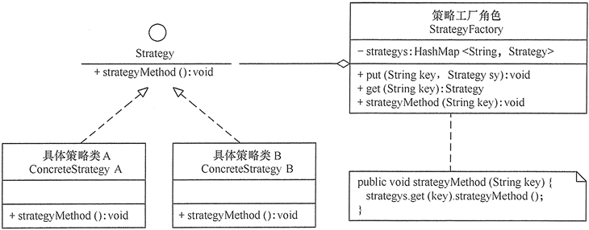

[TOC]

# 简介

- 将每个算法封装起来，使它们可以相互替换。


# 模式结构

主要角色：

- 抽象策略（Strategy）类：定义了一个公共接口，各种不同的算法以不同的方式实现这个接口，环境角色使用这个接口调用不同的算法，一般使用接口或抽象类实现。

- 具体策略（Concrete Strategy）类：实现了抽象策略定义的接口，提供具体的算法实现。

- 环境（Context）类：持有一个策略类的引用，最终给客户端调用。


## 模式扩展

一个使用策略模式的系统中，当存在的策略很多时，客户端管理所有策略算法将变得很复杂，如果在环境类中使用策略工厂模式来管理这些策略类将大大减少客户端的工作复杂度，其结构图如图



```cpp
// strategy.cpp 策略模式
#include <iostream>
using namespace std;

// 抽象策略类：路线
class RouteStrategy{
public:
    virtual string BuildRoute(const string& from, const string& to) = 0;
};

// 具体策略类：驾车导航
class DrivingStrategy : public RouteStrategy{
public:
    string BuildRoute(const string& from, const string& to) override {
        return "驾车导航路线: " + from + "->...->泉州->...->" + to;
    }
};
// 具体策略类：步行导航
class WalkingStrategy : public RouteStrategy{
public:
    string BuildRoute(const string& from, const string& to) override {
        return "步行导航路线: " + from + "->...->福州->...->" + to;
    }
};
// 具体策略类：公共交通导航
class PublicTransportStrategy : public RouteStrategy{
public:
    string BuildRoute(const string& from, const string& to) override {
        return "公共交通导航路线: " + from + "->...->莆田->...->" + to;
    }
};

// 环境类：导航器
class Navigator{
    RouteStrategy* strategy;
public:
    Navigator(RouteStrategy* s) : strategy(s){}
    string BuildRoute(const string& from, const string& to){
        if(strategy)
            return strategy->BuildRoute(from, to);
        return "规划路线失败：策略类为空.";
    }
    void SetStrategy(RouteStrategy* s) {
        strategy = s;
    }
};

int main(){
    Navigator* navigator = new Navigator(nullptr);
    cout << navigator->BuildRoute("厦门", "杭州") << endl;


    RouteStrategy* s1 = new PublicTransportStrategy;
    navigator->SetStrategy(s1);
    cout << navigator->BuildRoute("厦门", "杭州") << endl;


    RouteStrategy* s2 = new DrivingStrategy;
    navigator->SetStrategy(s2);
    cout << navigator->BuildRoute("厦门", "杭州") << endl;

    RouteStrategy* s3 = new WalkingStrategy;
    navigator->SetStrategy(s3);
    cout << navigator->BuildRoute("厦门", "杭州") << endl;

    delete s3;
    delete s2;
    delete s1;
    delete navigator;
    return 0;
}
```

输出

```shell
[root@QingYun build]# ./strategy 
规划路线失败：策略类为空.
公共交通导航路线: 厦门->...->莆田->...->杭州
驾车导航路线: 厦门->...->泉州->...->杭州
步行导航路线: 厦门->...->福州->...->杭州
```


> 问题：
>
> 使用重载函数，通过策略参数调用不同的策略实现函数，不仅可以减少类的数量还能简化代码结构？

# 应用场景


# 优缺点

## 优点

- 开闭原则。 你无需对上下文进行修改就能够引入新的策略。
- 将算法的实现和使用算法的代码隔离开来。
- 恰当使用继承可以把算法族的公共代码转移到父类里面，从而避免重复的代码。
- 提供相同行为的不同实现，客户可以根据不同时间或空间要求选择不同的。

## 缺点

- 客户端必须理解所有策略算法的区别，以便适时选择恰当的算法类。
- 策略模式造成很多的策略类，增加维护难度。


# 与其他模式的关系

- [桥接模式](https://refactoringguru.cn/design-patterns/bridge)、 [状态模式](https://refactoringguru.cn/design-patterns/state)和[策略模式](https://refactoringguru.cn/design-patterns/strategy) （在某种程度上包括[适配器模式](https://refactoringguru.cn/design-patterns/adapter)） 模式的接口非常相似。 实际上， 它们都基于[组合模式](https://refactoringguru.cn/design-patterns/composite)——即将工作委派给其他对象， 不过也各自解决了不同的问题。 模式并不只是以特定方式组织代码的配方， 你还可以使用它们来和其他开发者讨论模式所解决的问题。
- [命令模式](https://refactoringguru.cn/design-patterns/command)和[策略](https://refactoringguru.cn/design-patterns/strategy)看上去很像， 因为两者都能通过某些行为来参数化对象。 但是， 它们的意图有非常大的不同。
  - 你可以使用*命令*来将任何操作转换为对象。 操作的参数将成为对象的成员变量。 你可以通过转换来延迟操作的执行、 将操作放入队列、 保存历史命令或者向远程服务发送命令等。
  - 另一方面， *策略*通常可用于描述完成某件事的不同方式， 让你能够在同一个上下文类中切换算法。
- [装饰模式](https://refactoringguru.cn/design-patterns/decorator)可让你更改对象的外表， [策略](https://refactoringguru.cn/design-patterns/strategy)则让你能够改变其本质。
- [模板方法模式](https://refactoringguru.cn/design-patterns/template-method)基于继承机制： 它允许你通过扩展子类中的部分内容来改变部分算法。 [策略](https://refactoringguru.cn/design-patterns/strategy)基于组合机制： 你可以通过对相应行为提供不同的策略来改变对象的部分行为。 *模板方法*在类层次上运作， 因此它是静态的。 *策略*在对象层次上运作， 因此允许在运行时切换行为。
  - [状态](https://refactoringguru.cn/design-patterns/state)可被视为[策略](https://refactoringguru.cn/design-patterns/strategy)的扩展。 两者都基于组合机制： 它们都通过将部分工作委派给 “帮手” 对象来改变其在不同情景下的行为。 *策略*使得这些对象相互之间完全独立， 它们不知道其他对象的存在。 但*状态*模式没有限制具体状态之间的依赖， 且允许它们自行改变在不同情景下的状态。